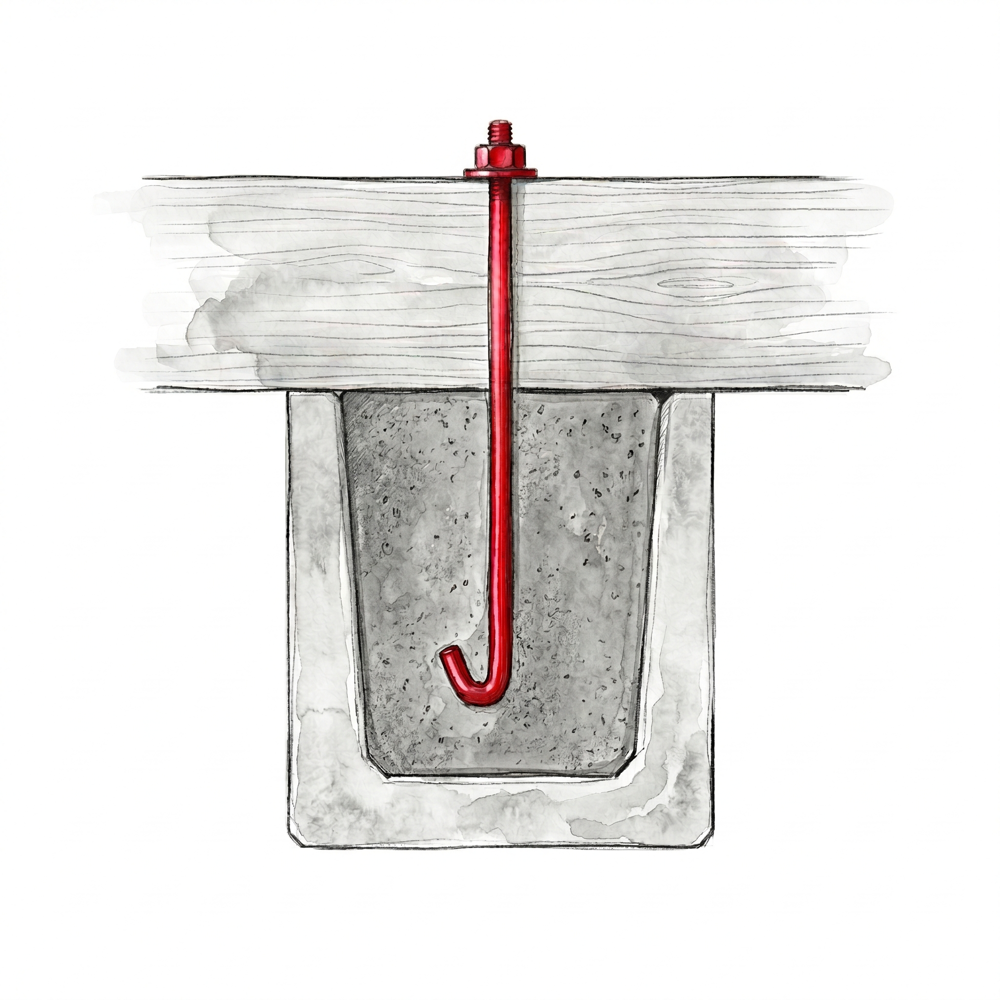

#### Créditos
Proyecto MADERAMEN · ADSIDEO Cooperación 2024

Equipo: Cátedra MADERAMEN, UPV

Diseño y edición: Equipo MADERAMEN

#### Agradecimientos
Entidades colaboradoras...

Licencia: CC BY-SA 4.0

# **Índice General de Pasos · Guía Práctica de Autoconstrucción**
#### Guía práctica de autoconstrucción — Proyecto MADERAMEN / ADSIDEO 2024

---

## 00 · Criterios de diseño (en desarrollo)
* **00.1 · Tamaño de la vivienda** — Cómo estimar la superficie necesaria en función del número de personas y los usos.
* **00.2 · Orientación** — Cómo orientar la vivienda para maximizar la ventilación cruzada y minimizar la entrada de lluvia y sol directo.
* **00.3 · Distribución interior** — Criterios básicos de organización de espacios: habitaciones, zona de cocina, accesos.
* **00.4 · El módulo** — Qué es el módulo estructural, por qué organiza toda la vivienda y cómo condiciona las decisiones posteriores.

---

## 01 · Pasos previos
* **01.1 · Limpieza del terreno** — Retirada de vegetación, raíces superficiales, tocones y extracción de la capa de tierra orgánica.
* **01.2 · Nivelación** — Uso de la manguera de agua para establecer el punto maestro, repartir el nivel y tirar el cordel de referencia.
* **01.3 · Compactación de rellenos** — Adición y humectación de tierra por capas de 15 cm y golpeo con el pisón manual.
* **01.4 · Replanteo** — Traslado de las medidas exactas de la vivienda del plano al terreno real mediante cordeles y estacas.
* **01.5 · Comprobación de escuadra** — Aplicación del método 3-4-5 en cada esquina para verificar ángulos de 90° exactos.
* **01.6 · Comprobación de diagonales** — Prueba definitiva midiendo las distancias cruzadas entre esquinas opuestas para asegurar el rectángulo.
* **01.7 · Replanteo de huecos de puerta** — Marcado y colocación de estacas con las medidas del hueco sumando el premarco de madera.

---

## 02 · Estructura de permanente · fundación

### 02.A · Zapata corrida
* **02.A.1 · Reconocimiento del terreno** — Identificación manual del tipo de suelo (roca, arena, arcilla) para determinar la profundidad.
* **02.A.2 · Excavación de la zanja** — Proceso de excavación con pico y pala manteniendo paredes verticales y fondo plano.
* **02.A.3 · Hormigón de limpieza** — Vertido de una capa base de hormigón pobre o colocación de lámina plástica de protección.
* **02.B.4 · Anclaje del durmiente de madera** — Perforación e introducción del durmiente en las esperas y fijación con hormigón fluido.
* **02.A.5 · Dosificación y mezcla del hormigón** — Proporciones y mezclado manual en seco y en húmedo de cemento, arena y grava.
* **02.A.6 · Vertido y compactación** — Llenado continuo de la zanja, picado manual con barra de hierro para eliminar burbujas y alisado.
* **02.A.7 · Curado** — Protección con plásticos o hojas y humectación diaria de la zapata durante un mínimo de 7 días.

### 02.B · Zócalo
* **02.B.1 · Preparación de bloques** — Modificación e incisión con martillo y cincel en los bloques para permitir el paso de las esperas.
* **02.B.2 · Primera hilada** — Extensión del mortero, colocación del primer bloque de esquina y avance nivelado del muro perimetral.
* **02.B.3 · Trabado de hiladas** — Alternancia de las juntas verticales entre hiladas de bloques en forma de "T" para dar resistencia.
* **02.B.4 · Zuncho perimetral** — Montaje del encofrado de madera, colocación de armaduras horizontales y vertido de la viga superior de atado.
* **02.B.5 · Anclaje del durmiente de madera** — Perforación e introducción del durmiente en las esperas y fijación con hormigón fluido.

### 02.C · Suelo interior
* **02.C.1 · Preparación del terreno interior** — Retirada de restos orgánicos, nivelación y compactación dentro del perímetro del zócalo.
* **02.C.2 · Suelo interior** — Solera de hormigón o tierra laterítica compactada: dos opciones según disponibilidad de recursos.

---

## 03 · Estructura de madera · Cerramiento
* **03.1 · Durmiente** — Presentación, perforación para las esperas, colocación a ras exterior del zócalo y aplicación de tratamiento protector.
* **03.2 · Replanteo de pilares sobre el durmiente** — Marcado con lápiz del eje central exacto de cada pilar respetando la cota de módulo.
* **03.3 · Colocación del primer pilar de esquina** — Aplomado vertical del pilar de referencia y fijación con clavos en diagonal al durmiente.
* **03.4 · Alineación y colocación del resto de pilares** — Uso del cordel guía tenso a una altura fija para alinear e instalar los pilares intermedios.
* **03.5 · Comprobación de escuadra de la estructura** — Verificación cruzada de las diagonales superiores de la estructura antes de entablar.
* **03.6 · Primera hilada de tablas** — Presentación y clavado horizontal de la tabla base de arranque directamente sobre el durmiente y los pilares.
* **03.7 · Solape e inclinación de tablas** — Colocación de las tablas consecutivas con solape de 3-4 cm e inclinadas al exterior para repeler el agua.
* **03.8 · Encuentro de esquina** — Alternancia del solape vertical de las tablas en los ángulos de la vivienda para evitar juntas abiertas.
* **03.9 · La viga de cubierta** — Colocación y fijación de la pieza horizontal que corona los montantes, los ata entre sí y recibe las cerchas de la cubierta.
* **03.10 · Remate superior del cerramiento** — Ajuste y fijación de la última hilada de tablas en su encuentro con la viga de cubierta.

---

## 04 · Estructura de madera · Cubierta
* **04.1 · Qué es una cercha** — Comprensión del funcionamiento y la estabilidad de la estructura triangulada de cubierta.
* **04.2 · Piezas de la cercha** — Identificación y preparación del tirante, par, montante y tornapunta.
* **04.3 · Fabricación de piezas en el suelo** — Uso de la plantilla para cortar y numerar las piezas, y validación de la geometría mediante una cercha de prueba.
* **04.4 · Uniones de la cercha** — Ejecución de los nudos estructurales mediante clavado, pletinas metálicas o ensambles tradicionales.
* **04.5 · Montaje de la cercha pieza a pieza** — Colocación progresiva de cada pieza directamente sobre la estructura desde andamios provisionales.
* **04.6 · Correas** — Instalación de las piezas longitudinales de madera que atan las cerchas y sirven de soporte a la chapa.
* **04.7 · Colocación de la chapa metálica** — Montaje con solape perimetral de las chapas de zinc y fijación con tornillos o clavos de gancho.
* **04.8 · Alero** — Ejecución del remate perimetral sobresaliente de la cubierta para desviar la lluvia de las paredes de madera.
* **04.9 · Cumbrera** — Fijación del remate metálico o pieza de cierre en la línea más alta de la cubierta para evitar filtraciones.

---

## 05 · Carpintería
* **05.1 · El hueco de puerta** — Configuración y refuerzo del espacio estructural entre pilares para recibir el marco.
* **05.2 · El premarco** — Fabricación de la subestructura de madera e instalación fija en el hueco del cerramiento.
* **05.3 · La puerta** — Construcción de la hoja de la puerta uniendo tablones de madera mediante travesaños reforzados.
* **05.4 · Colgado de la puerta** — Atornillado de bisagras, presentación en el premarco y ajuste final del batiente.
* **05.5 · El hueco de ventana** — Apertura y delimitación del espacio para ventilación entre las tablas del cerramiento.
* **05.6 · La ventana** — Construcción e instalación de soluciones locales: hojas abatibles, lamas fijas o bastidores con mosquitera.

---

## 06 · Mantenimiento
* **06.1 · Calendario de revisiones** — Programación de inspecciones al inicio de la estación seca y de la estación lluviosa.
* **06.2 · Inspección del zócalo** — Localización de grietas, humedades o caminos/galerías de tierra hechos por termitas.
* **06.3 · Inspección del cerramiento** — Identificación de tablas podridas por humedad, movimientos de pilares o juntas abiertas.
* **06.4 · Inspección de la cubierta** — Detección de chapas metálicas sueltas, puntos de óxido o filtraciones de agua.
* **06.5 · Inspección de carpintería** — Revisión del estado de las bisagras, desajustes en el cierre de puertas y ventanas o pudrición.
* **06.6 · Actuación ante termitas** — Aplicación de tratamientos de barrera o sustituciones urgentes antes de que afecte a los pilares.
* **06.7 · Reparación de una tabla de cerramiento** — Proceso de extracción y sustitución de una pieza de fachada dañada sin alterar el resto.
* **06.8 · Reparación de una chapa de cubierta** — Desmontaje de la chapa dañada o suelta y colocación de una nueva fijación impermeabilizada.

---

# **Pasos previos**

Antes de levantar cualquier muro o clavar cualquier poste, el terreno debe estar preparado. Estos cuatro pasos —analizar el terreno, limpiarlo, nivelarlo y replantearlo— son los más importantes de toda la obra. Si se hacen mal, todos los errores se acumulan y resultan muy difíciles de corregir.

El clima ecuatorial hace que estos pasos sean especialmente críticos: las lluvias intensas erosionan terrenos mal preparados, la vegetación tropical crece con rapidez si no se elimina bien desde la raíz, y la humedad del suelo puede arruinar una fundación si no se trabaja correctamente desde el principio.

> 🔑 **Regla de oro:** Un día bien invertido en preparar el terreno ahorra semanas de problemas después.

---

## **Herramientas y materiales necesarios**

### Medición y marcado
- Cinta métrica (mínimo 5 m)
- Manguera transparente (mínimo 10 m) — para usarla como nivel de agua
- Cordel grueso que **no sea elástico** (un rollo grande)
- Nivel de burbuja
- Plomada
- Rotulador indeleble o cinta aislante — para marcar el nivel en las estacas
- Tarro de vidrio transparente con tapa — para la prueba de sedimentación del suelo *(alternativa: cualquier recipiente cilíndrico transparente)*

### De trabajo
- Machete y azada
- Pico y pala de punta
- Carretilla
- Martillo y clavos
- Pisón manual — puede fabricarse con un tronco pesado y dos palos como mangos, o con un cubo de plástico lleno de hormigón y un palo fuerte en el centro

### Estacas y cordel
- 8 a 10 estacas de madera de 60–80 cm, afiladas en un extremo para clavarlas en el suelo — pueden ser ramas rectas de desecho o bambú
- Mazo o piedra para clavar las estacas

---

## **Paso 1 · Análisis del terreno**

### ¿Para qué sirve?

El terreno determina la profundidad y las dimensiones necesarias de la fundación. Construir sin conocer el tipo de suelo puede resultar en una zapata insuficiente que se asienta, se agrieta o falla con las primeras lluvias intensas.

En Guinea Ecuatorial es frecuente encontrar suelos arcillosos expansivos, especialmente en la zona fang interior, así como suelos con nivel freático alto en el litoral. Estos suelos exigen mayor cuidado que los suelos firmes o arenosos compactos. 

Antes de excavar ninguna zanja, se realizan dos pruebas sencillas que no requieren ningún instrumento especial.

---

### Prueba 1 · La prueba de la bola (reconocimiento inmediato)

Esta prueba permite identificar el tipo de suelo en el momento, con las manos y en el mismo solar.

**Cómo realizarla:**

1. Tomar un puñado de tierra de la zona donde se excavará la zanja, a unos 20–30 cm de profundidad (no de la superficie).
2. Si la tierra está seca, añadir unas gotas de agua y mezclar hasta que la humedad sea uniforme.
3. Comprimir el puñado con fuerza entre las palmas durante 10 segundos.
4. Abrir la mano y observar el resultado.

 

**Interpretación:**

| Resultado al abrir la mano | Tipo de suelo probable | Qué indica |
|---|---|---|
| La tierra se disgrega y cae, no mantiene forma | Arena o grava | Suelo permeable, buen drenaje. fundación estándar |
| Mantiene la bola con forma. Se ven marcas de dedos. Al secar se endurece | Arcilla o tierra arcillosa | Suelo expansivo. Requiere mayor profundidad de zapata |
| Mantiene la bola pero es esponjosa o fibrosa. Color oscuro, olor a tierra húmeda | Tierra orgánica o negra | **No apta para cimentar. Retirar completamente antes de excavar** |
| Bola compacta, rugosa, con partículas visibles. No se ve barro en las manos | Tierra firme o laterítica | Buen soporte. fundación estándar |

> ⚠️ Si el resultado es tierra orgánica o arcilla blanda, consultar la sección de *Tips específicos para Guinea Ecuatorial* al final de este capítulo antes de continuar.

---

### Prueba 2 · La prueba del tarro (análisis de sedimentación)

Esta prueba tarda entre 12 y 48 horas, pero da información más detallada sobre la composición del suelo. Es especialmente útil cuando la prueba de la bola genera dudas o cuando el suelo parece una mezcla de varios tipos.

**Cómo realizarla:**

1. Llenar un tarro de vidrio hasta un tercio de su capacidad con tierra del solar, tomada a la profundidad de la futura excavación. 
2. Rellenar con agua limpia hasta casi el borde.
3. Tapar, agitar con fuerza durante 1 minuto y dejar en reposo en un lugar estable, sin moverlo.
4. Esperar sin tocarlo:
   - **A los 2 minutos:** se habrán depositado en el fondo la grava y la arena gruesa.
   - **A los 30 minutos:** se habrá depositado la capa de arena fina por encima de la anterior.
   - **A las 12–48 horas:** se habrá depositado la arcilla y el limo por encima de todo. El agua quedará más o menos clara dependiendo de la cantidad de arcilla.

**Cómo leer el resultado:**

Una vez que el agua está en reposo y las capas bien formadas, medir con un palillo o una regla el grosor de cada capa y calcular qué porcentaje ocupa del total de sedimento.

| Composición aproximada | Interpretación | Decisión |
|---|---|---|
| Más del 50% de capa inferior (arena/grava) | Suelo granular, buen drenaje | fundación estándar. Profundidad mínima 60 cm |
| Capa superior (arcilla/limo) mayor que capa inferior | Suelo arcilloso dominante | Aumentar profundidad de zapata a 80–100 cm. Revisar drenaje perimetral |
| Agua permanece turbia o marrón incluso tras 48 horas | Arcilla muy fina o suelo orgánico en suspensión | Valoración técnica necesaria antes de continuar |
| Capa oscura flotando en la superficie | Materia orgánica presente | Retirar todo ese horizonte antes de excavar la zapata |

> ✅ **Recomendación:** Realizar ambas pruebas en cada esquina del solar, ya que el tipo de suelo puede variar de un punto a otro de la misma parcela.

---

### Tabla de decisión: qué hacer según el tipo de suelo

Una vez realizadas las pruebas, usar esta tabla para determinar las condiciones de la fundación:

| Tipo de suelo | Cómo se reconoce | Profundidad mínima | Ancho mínimo orientativo | Observaciones |
|---|---|---|---|---|
| Roca o grava compacta | Duro, no se deforma al pisar ni al presionar | 40 cm | 40 cm | Excelente. Caso ideal |
| Arena o tierra firme compacta | No cede al pisarlo. Bola de la prueba se disgrega | 60 cm | 40 cm | Bueno. Caso estándar |
| Suelo laterítico | Color rojizo, compacto, rugoso | 60 cm | 40 cm | Habitual en zona fang. Buen soporte |
| Arcilla o tierra blanda | Se deforma al pisarlo. Bola mantiene forma y marcas | 80–100 cm | 50–60 cm | Mayor riesgo de movimiento. Validar con el equipo técnico |
| Tierra negra u orgánica | Color oscuro, olor, esponjosa | — | — | **Retirar completamente. No cimentar sobre ella** |
| Terreno muy húmedo o con agua | Aparece agua al cavar a menos de 80 cm | — | — | Consultar con el equipo técnico antes de continuar |

> ⚠️ Los valores de ancho son orientativos para vivienda de una planta con estructura de madera ligera. En suelo blando o arcilloso deben calcularse en función de la carga real y la capacidad portante del terreno. Validar con el equipo técnico antes de excavar.

---

## **Paso 2 · Limpieza del terreno**

### ¿Para qué sirve?

Para retirar toda la vegetación, raíces y tierra orgánica que hay sobre el solar. Si se deja materia vegetal enterrada bajo la casa, esta se pudre con el tiempo, crea huecos y puede hundir la construcción.

### Proceso

1. **Cortar la vegetación** con machete: maleza, arbustos pequeños y todo lo que crezca dentro del perímetro de la futura casa y en una franja de al menos 1 metro alrededor.
2. **Arrancar raíces superficiales** con la azada. No basta con cortar lo que se ve por encima del suelo.
3. **Agrupar y retirar los restos** con la carretilla, llevándolos fuera del área de trabajo.
4. **Retirar la capa de tierra negra u orgánica:** en terrenos con capa vegetal oscura, se deben quitar al menos los primeros 10–15 cm de tierra, ya que esa tierra no es apta para sostener una fundación.

### Si hay árboles dentro de la huella de la casa

Se necesitará además:
- Hacha para cortar el árbol.
- Pala de punta para cavar alrededor del tocón y extraer las raíces profundas.
- Palanca para ayudar con las raíces resistentes o piedras grandes.

> ⚠️ **Importante:** No se puede construir sobre un tocón enterrado. La madera podrida crea huecos que pueden ceder con el peso de la construcción.

---

## **Paso 3 · Nivelación del terreno**

### ¿Para qué sirve?

Para asegurarse de que la base de la casa quede en un plano horizontal. Los terrenos suelen tener pendientes, irregularidades y zonas blandas. Un suelo bien nivelado garantiza que la estructura se asiente de forma uniforme.

---

### El nivel de manguera: método accesible y preciso

Este método se basa en una ley física sencilla: **el agua en reposo siempre queda al mismo nivel en los dos extremos de un tubo**, sin importar la distancia entre ellos ni los desniveles del terreno que haya en medio.

### Proceso paso a paso

**Preparación de la manguera:**

1. Llenar la manguera con agua limpia, asegurándose de que no queden burbujas de aire en el interior. Las burbujas producen mediciones incorrectas.
2. Para verificar que no hay burbujas, colocar los dos extremos uno al lado del otro: si el agua está a la misma altura en ambos, la manguera está lista.
3. No dejar la manguera al sol durante el proceso: el calor puede alterar ligeramente la medición.

**Establecer el Punto Maestro:**

1. Clavar una estaca en la esquina del terreno que parezca estar más alta.
2. Medir exactamente 1 metro desde el suelo hacia arriba en esa estaca y hacer una marca clara con el rotulador o cinta aislante. Esta marca es la **referencia de nivel** de toda la obra.

**Repartir el nivel (trabajo en pareja):**

Este paso requiere dos personas trabajando juntas:

- La **primera persona** permanece fija junto a la estaca maestra, con un extremo de la manguera, manteniendo el agua exactamente en la marca de 1 metro.
- La **segunda persona** lleva el otro extremo a la siguiente esquina y clava allí una nueva estaca.
- Cuando el agua se estabilice, la segunda persona hace una marca en su estaca donde quede el nivel del agua. Esa marca está exactamente a la misma altura que la marca de 1 metro de la primera estaca.
- Se repite el proceso en todas las esquinas y puntos intermedios del solar.

**Atar el cordel de referencia:**

Una vez que todas las estacas tienen su marca, se ata un cordel bien tenso pasando exactamente por todas las marcas. Ese cordel representa un plano horizontal perfecto.

**Leer el terreno:**

- Si la distancia desde el cordel hasta el suelo es **menor de 1 metro**: hay un montículo de tierra → quitar tierra con la azada hasta alcanzar la medida exacta.
- Si la distancia es **mayor de 1 metro**: hay una hondonada → añadir tierra y compactarla por capas (ver apartado siguiente).

---

### Cómo compactar bien la tierra añadida

Cuando haya que rellenar zonas bajas, **nunca se echa toda la tierra de golpe**. Se trabaja por capas:

1. Echar una capa de unos **15 cm** de tierra.
2. Humedecerla ligeramente con agua (debe quedar húmeda, no convertirse en barro).
3. Golpearla con fuerza con el pisón manual hasta que esté dura y no ceda al pisar.
4. Repetir capa por capa hasta llegar a la altura marcada por el cordel.

> ⚠️ **Cuidados durante la nivelación:**
> - Nadie debe pisar la manguera durante el proceso.
> - Tapar los extremos con el pulgar al desplazarse de una estaca a otra para no perder agua.
> - Si el terreno tiene pendiente fuerte, puede ser necesario un terraplenado previo (corte en la parte alta y relleno en la parte baja) antes de empezar la nivelación de detalle.

---

## **Paso 4 · Replanteo**

### ¿Para qué sirve?

El replanteo consiste en **dibujar sobre el terreno real las medidas exactas de la vivienda** antes de excavar. Es el momento de trasladar el plano al suelo.

Un buen replanteo garantiza que las paredes quedarán rectas, las esquinas en ángulo recto y las puertas en el lugar correcto.

---

### Proceso paso a paso

**1. Decidir las dimensiones de la vivienda**

Antes de clavar nada, hay que tener claras las medidas. Al elegir las dimensiones de los muros, conviene tener en cuenta el tamaño de los bloques de hormigón disponibles localmente, dejando siempre 1 cm de junta de mortero entre bloques.

**2. Colocar las estacas**

Las estacas se colocan **fuera de la zona de excavación**, a aproximadamente 1 metro de cada esquina de la futura casa. Así no se pierden cuando se excave la zanja.

**3. Tender los cordeles**

Se atan cordeles entre las estacas marcando la **cara exterior de los muros** de la casa.

**4. Comprobar que las esquinas son rectas: el método 3-4-5**

Este método garantiza que cada esquina sea un ángulo de 90° exacto, sin ningún instrumento de precisión. Funciona porque en todo triángulo rectángulo, si los dos lados perpendiculares miden 3 y 4, la diagonal entre sus extremos mide exactamente 5.

Proceso en cada esquina:

1. Clavar una estaca en la esquina y atar el cordel para marcar la primera pared.
2. Desde esa esquina, medir exactamente **3 metros** sobre el cordel de una pared y marcar ese punto.
3. Desde la misma esquina, extender el cordel de la pared perpendicular y medir exactamente **4 metros**, marcando ese punto también.
4. Pedir a alguien que mueva el segundo cordel hasta que la distancia entre los dos puntos marcados sea exactamente **5 metros**.
5. Cuando la distancia marque 5 metros, la esquina es perfecta. Clavar la estaca.

> 💡 El método funciona con cualquier escala proporcional: 30 cm / 40 cm / 50 cm también es válido. Cuanto mayor sea la escala, más preciso es el resultado. 

[→ Calculadora de esquinas (método 3-4-5)](calculadora_345.html) 

**5. La prueba definitiva: comprobar las diagonales**

Una vez colocados todos los cordeles, medir la distancia diagonal de una esquina a la esquina opuesta. Luego medir la otra diagonal.

- Si las dos diagonales son **iguales**: el rectángulo es perfecto. Se puede excavar.
- Si una diagonal es **más larga que la otra**: el rectángulo está deformado. Mover los cordeles hasta que coincidan.

**6. Replantear las puertas**

El hueco en el muro debe ser ligeramente mayor que la puerta física:

> Ancho del hueco = Ancho de la puerta + grosor del premarco de madera

Una vez decidida la ubicación, se clavan dos estacas en el suelo que marquen con precisión los límites del hueco de cada puerta. Esta medida debe guardar relación con el módulo de los bloques de hormigón.

**7. Posición de las guías de excavación**

Los cordeles del replanteo marcan la **cara exterior del muro**, no el eje de la excavación. Al excavar la zanja de fundación, el operario se guía por esa cuerda sabiendo que deberá excavar tanto hacia el interior como hacia el exterior del muro según las dimensiones de la zapata.

---

## 🌿 **Tips específicos para el contexto de Guinea Ecuatorial**

---

**1. La arcilla expansiva: el principal riesgo de la región**

Los suelos arcillosos típicos de la zona fang y del litoral se contraen cuando se secan y se expanden cuando se mojan. Este movimiento repetido puede agrietar la fundación con el tiempo. La profundidad de la zapata es la principal defensa: cuanto más profunda, más estable es el comportamiento del suelo. Nunca construir sobre la capa superficial orgánica negra.

**2. Nivel freático alto en la estación lluviosa**

Si al realizar las pruebas de terreno aparece agua a menos de 80 cm de profundidad, el nivel freático es alto. En este caso, aumentar la impermeabilización de la base y elevar más el zócalo. Consultar con el equipo técnico del proyecto antes de continuar.

**3. Realizar el replanteo por la mañana temprano**

En días muy calurosos, el cordel puede dilatarse ligeramente con el calor y dar medidas algo imprecisas. Trabajar preferiblemente entre las 6 y las 10 de la mañana.

**4. Proteger las estacas del replanteo**

Una vez clavadas, las estacas del replanteo no deben moverse hasta terminar de hormigonar la zapata. Pueden marcarse con un trozo de tela o pintura para que todo el equipo las identifique y no las desplace accidentalmente.

**5. Disponibilidad de manguera transparente**

La manguera transparente es el instrumento clave para la nivelación. Si no está disponible en el mercado local, puede sustituirse por un tubo fino de PVC translúcido. Verificar la disponibilidad en campo antes de la obra.

---

## Resumen: comprobaciones antes de avanzar

Antes de pasar a la fundación, verificar que se han completado correctamente estos puntos:

- [ ] Se han realizado la prueba de la bola y la prueba del tarro en varias zonas del solar.
- [ ] El tipo de suelo está identificado y se ha determinado la profundidad de zapata correspondiente.
- [ ] El terreno está libre de vegetación, raíces y tierra orgánica en toda la huella de la vivienda y al menos 1 metro alrededor.
- [ ] Se han retirado los primeros 10–15 cm de tierra negra u orgánica donde los hubiera.
- [ ] El terreno está nivelado: la distancia desde el cordel de referencia hasta el suelo es igual en todos los puntos.
- [ ] Las zonas rellenas se han compactado por capas de 15 cm con pisón.
- [ ] Las estacas del replanteo están colocadas fuera de la zona de excavación.
- [ ] Cada esquina ha sido comprobada con el método 3-4-5.
- [ ] Las dos diagonales son iguales.
- [ ] La posición de las puertas está marcada con estacas.

---

---

# **Fundaciones**

---

La fundación es la parte de la vivienda que transmite todo el peso al suelo. Si falla la fundación, falla toda la casa. En Guinea Ecuatorial, el suelo arcilloso, la humedad constante y las lluvias intensas hacen que esta fase sea especialmente crítica. Hacerla bien desde el principio evita problemas muy difíciles de corregir después.

> 🔑 **Regla de oro:** Una fundación bien ejecutada es invisible una vez terminada la casa. Una fundación mal ejecutada se hace visible en forma de grietas, hundimientos o pudrición de la madera.

---

## Estructura general

Esta sección cubre tres elementos que trabajan juntos:

1. **ZAPATA CORRIDA** — La base enterrada de hormigón armado que reparte el peso de la vivienda sobre el terreno.
2. **ZÓCALO** — El muro de bloques de hormigón construido sobre la zapata, que eleva la estructura de madera por encima del nivel del suelo y la protege de la humedad y las termitas.
3. **SUELO INTERIOR** — La superficie sobre la que se pisa dentro de la vivienda. Frena la humedad ascendente, dificulta el acceso de las termitas y sirve de base para las particiones y los umbrales. Se ejecuta después de que la cubierta esté terminada.

---

## **Herramientas y materiales necesarios**

### Para la excavación
- Pico y pala de punta
- Carretilla
- Cinta métrica

### Para las armaduras
- Barras de acero corrugado de diámetro 8 mm *(mínimo viable)* o 10–12 mm *(recomendado si está disponible)*
- Alambre de amarrar fino, de 1 a 1,5 mm de diámetro
- Cizalla o sierra para metales
- Tubo metálico hueco de unos 50 cm de longitud, para doblar las varillas en forma de "L" haciendo palanca

### Para el hormigón
- Cemento Portland
- Arena limpia, sin barro ni sales — nunca arena de playa sin lavar
- Grava o piedra machacada *(puede reutilizarse la extraída de la propia excavación si está limpia y libre de barro)*
- Agua dulce y limpia — nunca agua salada ni de río con barro visible
- Recipiente de medida de volumen constante: un cubo, una lata o un capazo *(el mismo recipiente se usa para medir todas las partes de la dosificación)*
- Superficie plana para mezclar: losa de hormigón, tablero de madera o el propio suelo limpio

### Para el zócalo
- Bloques de hormigón en cantidad suficiente para 3 hiladas perimetrales *(orientativo: 3 hiladas de bloque estándar de 20 cm de altura equivale a unos 60 cm de zócalo)*
- Mortero de cemento y arena en proporción 1:3 o 1:4
- Paleta de albañil
- Nivel de burbuja
- Plomada
- Martillo y cincel para ajustar bloques

### Para protección y curado
- Sacos de tela, hojas de plátano, cartones o lámina de plástico — para cubrir el hormigón durante el curado
- Cubo de agua para el riego de curado

### Para el suelo interior
- Pisón manual
- Tierra laterítica rojiza —del propio solar o de un préstamo cercano— para la opción de tierra compactada
- Arena gruesa o grava fina, para la capa de acabado de la opción de tierra *(opcional)*
- Lámina de plástico grueso —para la barrera de humedad de la opción hormigón
- Cemento, arena y grava —misma dosificación que la zapata— para la opción de hormigón
- Regla o listón recto de madera de al menos 2 m —para enrasar la solera

---

# **Parte 1: Zapata corrida**

## **Paso 1 · Reconocimiento del terreno**

### ¿Para qué sirve?

El tipo de suelo determina la profundidad de la zapata. Una zapata demasiado superficial en suelo blando puede asentarse o agrietarse con las primeras lluvias intensas. Este paso debe haberse iniciado ya en la fase de pasos previos, donde se describen la prueba de la bola y la prueba del tarro para identificar el suelo. Si aún no se han realizado esas pruebas, hacerlas antes de continuar.

### Profundidades y anchos de excavación

La profundidad y el ancho de la zanja dependen del tipo de suelo identificado en el Paso 1 · Análisis del terreno del capítulo de **Pasos previos**. Si aún no se ha realizado ese análisis, hacerlo antes de continuar.

Como referencia rápida para suelo firme o laterítico: profundidad mínima 60 cm, ancho mínimo 40 cm. En arcilla blanda: 80–100 cm de profundidad y 50–60 cm de ancho. En todos los casos, el equipo técnico debe realizar al menos una cata manual en cada parcela antes de confirmar las dimensiones definitivas.

---

## **Paso 2 · Excavación de la zanja**

### ¿Para qué sirve?

La zanja es el molde natural donde se construirá la zapata. Sus dimensiones determinan la superficie de apoyo sobre el terreno y el espacio disponible para colocar la armadura con el recubrimiento mínimo necesario —distancia entre la barra de acero y la cara exterior del hormigón que protege el hierro de la humedad.

### Dimensiones de la zanja

La zanja debe tener el **ancho mínimo** indicado en la tabla del Paso 1 según el tipo de suelo. El ancho se mide en el interior de la zanja, de pared a pared.

La referencia de replanteo —el cordel— marca la **cara exterior del muro**. La zanja se desarrolla simétricamente a ambos lados de esa referencia: la mitad del ancho hacia el exterior y la otra mitad hacia el interior de la vivienda.

> 💡 **Ejemplo:** En suelo firme, la zanja tiene 40 cm de ancho. El cordel marca la cara exterior del muro. Se excavan 20 cm hacia fuera del cordel y 20 cm hacia dentro.

### Proceso

1. La excavación parte de los cordeles del replanteo, que marcan la **cara exterior del muro**. La zanja se desarrolla hacia el interior de la huella de la vivienda a partir de esa referencia, dejando espacio suficiente a cada lado del futuro muro para alojar la armadura.
2. Se usa el pico para romper el terreno y la pala de punta para extraer la tierra.
3. Las paredes de la zanja se mantienen verticales. El fondo debe ser lo más plano posible.
4. La tierra extraída se retira alejándola del borde para que no caiga de nuevo a la zanja.
5. La grava o piedra limpia que aparezca durante la excavación se guarda aparte: puede reutilizarse en el hormigón.

> ✅ **A tener en cuenta:** La zanja se excava el mismo día que se va a hormigonar, o se cubre con lámina de plástico si hay que esperar. En Guinea Ecuatorial, una lluvia nocturna puede inundar o desmoronar las paredes de una zanja abierta. Si la obra se para durante días o semanas, se rellena la zanja parcialmente con la tierra extraída para proteger el fondo, y se vuelve a excavar cuando se retome el trabajo.

---

## **Paso 3 · Capa de protección del fondo**

### ¿Para qué sirve?

El fondo de la zanja necesita una capa de protección antes de colocar las armaduras. Esta capa aísla el acero de la humedad directa del suelo, evitando la corrosión, y proporciona una superficie limpia y plana sobre la que trabajar.

**Preparación previa en cualquier caso:**

- Se elimina toda el agua estancada en el fondo sacándola con un cubo.
- Se retira el barro suelto del fondo con la pala.
- Si se usan piedras locales en el hormigón, se lavan antes: el barro impide que el cemento se adhiera a la piedra y debilita el conjunto.

---

**Opción A — Hormigón de limpieza** *(recomendada)*

Se vierte una capa de unos 5–10 cm de hormigón pobre —dosificación 1 parte de cemento, 3 de arena y 6 de grava— con agua suficiente para que quede trabajable. Se deja endurecer al menos 12 horas antes de colocar la armadura encima.

---

**Opción B — Lámina de plástico** *(alternativa si no hay cemento disponible para la limpieza)*

Se extiende una lámina de plástico grueso en el fondo de la excavación, solapando los bordes un mínimo de 20 cm y subiéndola también por las paredes laterales unos 10 cm. Si no hay lámina, se usan bolsas de plástico solapadas formando una capa continua. Es menos eficaz que el hormigón de limpieza, pero mucho mejor que dejar las armaduras en contacto directo con el suelo.

---

**Si no se dispone de ninguna de las dos opciones:**

La zapata puede ejecutarse sin capa de protección, pero en ese caso se aumenta el recubrimiento mínimo de la armadura: las barras de acero deben quedar a al menos 7–8 cm del fondo de la zanja en lugar de los 5 cm estándar. Los calzos que soportan la armadura deben ser de hormigón o bloque, nunca de madera.

---

## **Paso 4 · Armadura de la zapata**

### ¿Para qué sirve?

El hormigón resiste bien la compresión —cuando se le aplasta— pero es frágil a la tracción —cuando se le estira o dobla. La armadura de acero es la que aporta esa resistencia a tracción. Sin armadura, la zapata puede agrietarse y partirse, especialmente en suelos que se mueven con la humedad.

### Sobre el acero disponible localmente

En el mercado local es frecuente encontrar principalmente redondos corrugados de Ø 6 mm y Ø 8 mm, aunque en algunos puntos puede haber Ø 10 mm y Ø 12 mm a mayor coste. La guía contempla dos niveles de armado según lo que esté disponible:

| Diámetro disponible | Uso recomendado | Observación |
|---|---|---|
| Ø 8 mm | Armadura principal de la zapata | Mínimo recomendado para zapata corrida |
| Ø 6 mm | Solo si no hay Ø 8 mm disponible | Aumentar el número de barras a 3 longitudinales en lugar de 2 |
| Ø 10–12 mm | Armadura principal si está disponible y el presupuesto lo permite | Mayor resistencia; especialmente recomendado en suelos blandos |

> ⚠️ Estos diámetros y configuraciones deben ser validados por el equipo técnico en función de las cargas reales del prototipo.

---

### Opción A — Armado completo *(mayor resistencia)*

El armado completo incluye barras longitudinales a lo largo de toda la zapata más cercos o estribos transversales que atan el conjunto. Es el sistema más resistente y el recomendado si hay material y mano de obra con experiencia.

**Barras longitudinales:**

1. Las barras se cortan a la longitud de cada tramo de pared, dejando unos 5 cm de retranqueo en cada extremo para que no asomen por fuera del hormigón.
2. En las esquinas, la barra no se corta al llegar al encuentro: se dobla el extremo en forma de "L" con al menos 40 cm de longitud de doblado, para que abrace la barra perpendicular de la pared contigua.

**Cómo doblar las barras en L:**

Se introduce el extremo de la barra dentro del tubo metálico hueco y se usa el tubo como palanca para doblar la barra de forma controlada hasta conseguir un ángulo lo más cercano a 90° posible.

**Colocación de las barras:**

1. Las barras se colocan sobre pequeños calzos de bloque roto o mortero endurecido que las eleven un mínimo de 5 cm sobre la capa de protección del fondo. La madera no es apta como calzo: se pudre, deja huecos y permite la entrada de humedad.
2. Se colocan 2 barras paralelas a lo largo de toda la zanja, separadas entre sí entre 15 y 20 cm.
3. Las barras se atan en los cruces con alambre fino.

---

### Opción B — Armado mínimo *(cuando los recursos son muy limitados)*

Cuando no hay material suficiente para el armado completo con estribos, se colocan únicamente las barras longitudinales sin cercos transversales. Esto reduce la resistencia del conjunto, especialmente frente a movimientos del terreno, pero sigue siendo significativamente mejor que una zapata sin armadura.

En este caso:
- Se usan al menos 2 barras longitudinales de Ø 8 mm, o 3 barras de Ø 6 mm.
- Las esquinas se doblan en "L" igualmente.
- Se prescinde de los estribos o cercos transversales.

> ⚠️ El armado mínimo debe ser validado por el equipo técnico antes de aplicarse. No es adecuado en suelos blandos o arcillosos, ni en viviendas con más de una planta.

---

## **Paso 5 · Esperas verticales**

### ¿Para qué sirve?

Las esperas son varillas de acero que sobresalen verticalmente de la zapata hacia arriba. Su función es conectar la zapata con el zócalo de bloques, creando una cadena estructural continua desde el suelo hasta la estructura de madera. Sin esperas, el zócalo y la zapata trabajan como piezas separadas que pueden desplazarse entre sí.

### Planificación previa

La posición de cada espera debe planificarse durante el replanteo, porque deben quedar centradas dentro del hueco interior de los bloques del futuro zócalo. Los cordeles del replanteo sirven de referencia. Una espera mal posicionada impide colocar los bloques encima sin forzarlos. 

### Proceso

1. La base de cada espera vertical se ata a la armadura horizontal con alambre, en la posición correcta. 
2. La espera se mantiene vertical mediante una guía sencilla: dos trozos de bambú o listón de madera atados en forma de "V" invertida que la sujetan hasta que el hormigón endurece.
3. Antes de hormigonar, se verifica que todas las esperas están verticales y alineadas.

> ✅ **Prueba de comprobación:** Antes de verter el hormigón, se presenta un bloque sobre la zanja sin apoyarlo. Las esperas deben pasar por el hueco interior del bloque con holgura, sin rozar las paredes. Si rozan, se ajusta la posición antes de continuar.

---

## **Paso 6 · Preparación y dosificación del hormigón**

### ¿Para qué sirve?

La dosificación —la proporción entre cemento, arena y grava— determina la resistencia del hormigón. Una mezcla con poco cemento o demasiada agua queda débil aunque parezca correcta al verterla. En Guinea Ecuatorial, el calor y la humedad aceleran el fraguado y hacen más crítico trabajar con la dosificación adecuada.

### Dosificación recomendada para la zapata

> **1 parte de cemento : 2 partes de arena : 3 partes de grava**

Se mide siempre con el **mismo recipiente** (un cubo, una lata, un capazo). No importa el tamaño del recipiente, sino que la proporción se respete en cada amasada. Por ejemplo, con un cubo de 10 litros: 1 cubo de cemento, 2 cubos de arena, 3 cubos de grava.

| Ingrediente | Partes | Ejemplo con cubo de 10 l |
|---|---|---|
| Cemento | 1 | 1 cubo |
| Arena limpia | 2 | 2 cubos |
| Grava o piedra machacada | 3 | 3 cubos |
| Agua | La mínima necesaria | Ver prueba de consistencia |

**Prueba de consistencia:** Al coger un puñado de la mezcla y apretarlo, debe mantener la forma sin chorrear agua. Si chorrea, la mezcla tiene demasiada agua y el hormigón quedará débil.

---

### Alternativa de menor coste: hormigón ciclópeo

Cuando la disponibilidad de áridos —grava y arena— es limitada o el coste es un factor crítico, puede emplearse hormigón ciclópeo. Consiste en introducir piedras limpias de tamaño puño directamente en la masa de hormigón fresco según se vierte, ocupando hasta un tercio del volumen total.

Condiciones para que funcione correctamente:
- Las piedras deben estar limpias de barro —lavarlas antes de usarlas.
- Cada piedra debe quedar completamente rodeada de hormigón, sin que dos piedras se toquen entre sí.
- No usar piedras cerca de las armaduras: el recubrimiento mínimo de la barra debe respetarse.

> ⚠️ El hormigón ciclópeo reduce la cantidad de cemento y áridos necesarios sin comprometer significativamente la resistencia si se ejecuta correctamente. Debe ser validado por el equipo técnico antes de aplicarse en el prototipo.

---

### Cómo mezclar sin hormigonera

1. Se extienden la arena y la grava sobre la superficie de mezcla y se añade el cemento encima.
2. Se mezcla en seco con la pala hasta obtener un color uniforme sin vetas grises.
3. Se abre un hueco en el centro de la pila y se añade el agua poco a poco, mezclando desde los bordes hacia el centro.
4. Se continúa mezclando hasta que la mezcla sea homogénea y pase la prueba de consistencia.

> ⚠️ Solo se amasa la cantidad que pueda verterse en 30–45 minutos. El calor ecuatorial acelera el fraguado: una mezcla que empieza a endurecer no debe reutilizarse añadiéndole más agua.

---

## **Paso 7 · Vertido y curado del hormigón**

### ¿Para qué sirve?

El vertido es la operación de introducir el hormigón en la zanja y compactarlo alrededor de las armaduras. El curado es el proceso de mantener el hormigón húmedo durante los primeros días para que desarrolle su resistencia. En Guinea Ecuatorial, el curado húmedo es especialmente importante porque el calor seca el hormigón antes de que haya fraguado correctamente.

### Vertido 

1. Lo ideal es hormigonar toda la zapata en el mismo día y de forma continua, sin interrupciones. Las juntas de hormigonado —cuando se para y se retoma al día siguiente— son puntos débiles que pueden fallar. Si la longitud de la zapata obliga a parar, la junta se hace siempre en el punto de menor esfuerzo: en el centro de un tramo recto, nunca en una esquina.
2. Se comienza por una esquina y se avanza de forma continua.
3. El hormigón no se deja caer desde más de 1 metro de altura: el impacto puede mover las armaduras o segregar los áridos —separar la grava de la pasta de cemento.
4. **Compactación sin vibrador mecánico:** se introduce un palo robusto o una barra de hierro repetidamente en el hormigón fresco con fuerza, según se vierte. El objetivo es eliminar las burbujas de aire atrapadas y que el hormigón rodee completamente todas las varillas.
5. Al terminar, se usa un tablón de madera recto para igualar la superficie. La superficie se deja ligeramente rugosa —no lisa— para que el mortero de la primera hilada de bloques adhiera mejor.

### Curado

La zapata se cubre inmediatamente después del vertido con sacos de tela, hojas de plátano, cartones o lámina de plástico, y se moja con agua una o dos veces al día durante al menos **7 días**. El hormigón no desarrolla su resistencia si se seca con el calor: el curado húmedo es tan importante como la dosificación.

| Tiempo transcurrido | Resistencia aproximada alcanzada | Qué se puede hacer |
|---|---|---|
| 24 horas | ~15–25 % | Nada. No cargar, no pisar |
| 3 días | ~40–50 % | Se puede comenzar el zócalo **con mucha precaución**, siguiendo mojando |
| 7 días | ~60–65 % | Trabajo normal sobre el zócalo |
| 28 días | 100 % | Resistencia de diseño completa |

> ⚠️ Estos valores son orientativos para hormigón amasado a mano en clima cálido. Con curado deficiente o agua de mezcla excesiva, la resistencia real puede ser menor. **La regla práctica es: cuanto más días de curado húmedo, mejor.**

> ⚠️ No se hormigona bajo lluvia intensa: el agua de lluvia puede lavar el cemento de la mezcla fresca antes de que fragüe.

---

# **Parte 2: Zócalo**

El zócalo es el muro de bloques de hormigón que se construye sobre la zapata. Su función es elevar la estructura de madera por encima del nivel del suelo, protegiéndola de tres riesgos principales: la humedad ascendente, las inundaciones por lluvia y el ataque de termitas, que en Guinea Ecuatorial puede representar una amenaza grave para cualquier pieza de madera en contacto con el suelo.

La altura mínima del zócalo es de **3 hiladas de bloque** sobre el nivel del suelo terminado, lo que equivale aproximadamente a 60 cm con bloque estándar de 20 cm de altura. En terrenos muy húmedos o con riesgo de inundación, se recomienda añadir una cuarta hilada.

> 💡 **Por qué es crítico elevar la madera en Guinea Ecuatorial:** Las termitas construyen galerías de tierra desde el suelo hasta la madera que atacan. Cuanto mayor sea la distancia entre el suelo y la madera, más difícil y visible es esa galería. Un zócalo de 60 cm obliga a las termitas a construir una galería larga y expuesta, fácilmente detectable en una inspección visual.

---

## **Paso 8 · Preparación de los bloques**

### ¿Para qué sirve?

Los bloques estándar de hormigón tienen dos o tres huecos interiores por los que deben pasar las esperas verticales que vienen de la zapata. Para que la espera pase sin forzar el bloque, es necesario abrir un hueco en la base del bloque en los puntos donde haya una espera.

### Proceso

1. Se identifican qué bloques de la primera hilada coincidirán con una espera vertical.
2. En esos bloques, se practica la apertura en la base con un martillo y un cincel, o con la punta del pico, rompiendo solo la parte necesaria para que la varilla pase con holgura.
3. Se comprueba que la espera pasa por el hueco abierto antes de extender el mortero.

---

## **Paso 9 · Colocación de las hiladas de bloques**

### ¿Para qué sirve?

Las hiladas de bloques forman el muro del zócalo. La clave de su resistencia no está solo en el mortero sino en el **trabado**: la disposición alternada de las juntas entre hiladas, que evita que haya líneas de debilidad continuas de arriba abajo del muro.

### Proceso

1. Se prepara el mortero: 1 parte de cemento por 3–4 de arena, con agua suficiente para que sea manejable pero no líquido.
2. Se humedece la superficie de la zapata antes de extender el mortero: el mortero adhiere mejor sobre una superficie ligeramente húmeda, no seca ni encharcada.
3. Se extiende una capa de mortero de 1 a 1,5 cm sobre la zapata.
4. Se coloca el primer bloque en una esquina y se nivela en todas direcciones con el nivel de burbuja.
5. Se avanza a lo largo del muro, bloque a bloque, comprobando nivel y aplomo —verticalidad— con la plomada en cada hilada.

**Regla del trabado:** Las juntas verticales entre bloques de una hilada no deben coincidir con las juntas de la hilada inferior. El bloque superior queda centrado sobre la junta de los dos bloques de abajo. En las esquinas, se alterna la dirección del bloque de esquina entre hiladas para crear el trabado en las dos direcciones.

> ✅ La junta de mortero entre bloques debe ser de aproximadamente 1 cm. Más de esa medida debilita el conjunto; menos impide la adhesión correcta.

---

---

## **Paso 10 · Relleno de los huecos con hormigón fluido**

### ¿Para qué sirve?

Los huecos interiores de los bloques donde hay esperas verticales deben rellenarse con hormigón fluido. Este relleno solidariza la espera con el bloque, crea una columna interna de hormigón armado continua desde la zapata hasta la parte superior del zócalo, y aumenta significativamente la resistencia del muro frente a las cargas de la cubierta.

### Proceso

1. Una vez colocadas todas las hiladas de bloques, se prepara hormigón fluido con la misma dosificación que la zapata pero con más agua, para que pueda verterse y fluir dentro de los huecos estrechos del bloque.
2. Se vierte el hormigón fluido por el interior de los bloques que alojan esperas, hasta llenar completamente el hueco.
3. Se introduce un palo fino para compactar y eliminar burbujas.
4. Se repite en todos los puntos de espera a lo largo del perímetro.

> ⚠️ Si el hormigón fluido es demasiado líquido, puede salir por las juntas de mortero entre bloques. Se ajusta la consistencia añadiendo menos agua y se tapan temporalmente las juntas inferiores con un trozo de mortero si es necesario.

---

# **Parte 3: Suelo interior**

El suelo interior es la superficie sobre la que se pisa dentro de la vivienda. Además del uso cotidiano, cumple dos funciones que afectan a la durabilidad del conjunto: frena la humedad que asciende desde el terreno hacia la estructura de madera, y dificulta el acceso de las termitas al interior.

El suelo interior **se ejecuta después de que la cubierta esté terminada**, para que pueda curarse o compactarse protegido de la lluvia. El terreno interior puede prepararse ahora —antes de levantar las paredes— para facilitar el trabajo, pero el acabado final se aplica al final de la obra.

---

## **Paso 11 · Preparación del terreno interior**

### ¿Para qué sirve?

Antes de ejecutar el suelo, el terreno interior debe estar limpio, nivelado y compactado. Un suelo asentado sobre tierra suelta o con restos orgánicos puede hundirse y agrietarse con el tiempo.

### Proceso

1. Se retiran todos los restos orgánicos, raíces y tierra vegetal que queden dentro del perímetro del zócalo.

2. Se nivela el terreno interior hasta alcanzar una cota aproximadamente **15 cm por debajo** de la cara superior del zócalo. Esta diferencia garantiza que el suelo terminado no quede al mismo nivel que el durmiente de madera, evitando el contacto entre la madera y la humedad del suelo.

3. Se compacta el terreno por capas de 10–15 cm con el pisón, igual que en los rellenos exteriores.

---

## **Paso 12 · Suelo interior**

### Opción A · Solera de hormigón

La solera de hormigón es la opción más duradera e higiénica. Una vez fraguada, proporciona una superficie dura, fácil de limpiar y resistente a la humedad ascendente.

#### Materiales
- Lámina de plástico grueso
- Cemento, arena y grava en proporción 1 : 2 : 3
- Regla o listón recto de al menos 2 m
- Fratacho o tabla lisa húmeda para alisar

#### Proceso

1. Se extiende la **lámina de plástico** sobre el terreno compactado, cubriendo toda la superficie. Los solapes entre piezas son de al menos 20 cm. La lámina sube también por las caras interiores del zócalo unos 5 cm para cortar la humedad en el encuentro.

2. Se vierte el hormigón sobre la lámina. El espesor mínimo recomendado es de **8 cm**.

3. Se extiende y enrasa el hormigón con la regla, apoyando sus extremos sobre la cara interior del zócalo para mantener la cota uniforme.

4. Una vez enrasado, se alisa la superficie con el fratacho o una tabla lisa húmeda.

5. Se cura durante al menos **7 días**: se cubre con sacos húmedos, hojas de plátano o lámina de plástico y se riega cada mañana.

> ⚠️ La solera no debe quedar en contacto con el durmiente de madera. Debe existir siempre una pequeña separación entre la cara superior de la solera y la cara inferior del durmiente para que la madera no absorba humedad desde el hormigón.

---

### Opción B · Suelo de tierra compactada

El suelo de tierra compactada es la solución de coste cero y la más habitual en la construcción local. Correctamente ejecutado y mantenido, es una superficie estable, fresca y culturalmente integrada.

#### Materiales
- Tierra laterítica rojiza —del solar o de un préstamo cercano
- Arena gruesa o grava fina para la capa de acabado *(opcional)*
- Pisón manual

#### Proceso

1. Sobre el terreno compactado del Paso 11, se añade una capa de **tierra laterítica** de 5–8 cm. La tierra laterítica —el suelo rojizo habitual en la región— compacta bien y resiste el tránsito cuando se trabaja húmeda.

2. Se humedece ligeramente la capa y se compacta con el pisón hasta que la superficie esté dura y no ceda al pisar.

3. Opcionalmente, se extiende una capa fina de **arena gruesa o grava fina** (1–2 cm) como acabado. Reduce el polvo y mejora el drenaje de pequeños derrames.

#### Mantenimiento

El suelo de tierra requiere revisión periódica: al inicio de cada estación seca se identifican las zonas hundidas o disgregadas, se añade tierra laterítica húmeda y se recompacta. Si con el tiempo se dispone de recursos, puede aplicarse una solera de hormigón directamente encima sin necesidad de demoler nada.

> 💡 El suelo de tierra es un punto de partida, no una solución definitiva. Puede mejorarse progresivamente a medida que los recursos lo permitan.

---

### A tener en cuenta — ambas opciones

El encuentro entre el suelo interior y la base del zócalo es el punto más vulnerable a la entrada de agua. La cara exterior del zócalo al nivel del suelo exterior debe quedar siempre **por encima** de la cara superior del suelo interior, para que el agua de lluvia no entre rebosando hacia el interior.

---

# 🌿 **Tips específicos para el contexto de Guinea Ecuatorial**

---

**1. La arcilla expansiva: el principal riesgo del suelo**

Los suelos arcillosos típicos de la zona fang y del litoral se contraen cuando se secan y se expanden cuando se mojan. Este movimiento repetido puede agrietar la fundación a lo largo del tiempo. La profundidad de la zapata es la principal defensa: cuanto más profunda, más estable es el comportamiento del suelo. Nunca se construye sobre la capa superficial orgánica de color negro.

**2. Nivel freático alto en la estación lluviosa**

Si al realizar las pruebas de terreno aparece agua a menos de 80 cm de profundidad, el nivel freático —la capa de agua subterránea— es alto. En ese caso: aumentar el espesor de la capa de protección del fondo, elevar el zócalo a 4 hiladas en lugar de 3, y consultar con el equipo técnico antes de continuar.

**3. Almacenamiento del cemento**

En Guinea Ecuatorial, el cemento absorbe humedad del ambiente y puede endurecerse dentro del saco antes de usarse. Se almacena siempre en lugar cubierto y ventilado, sobre tarimas de madera —nunca directamente sobre el suelo— y no más de 3–4 semanas sin usar. Si al abrir un saco el cemento tiene grumos duros que no se deshacen al presionarlos, ya no sirve.

**4. Reutilización de la grava de la excavación**

La grava extraída de la excavación puede reutilizarse en el hormigón si está limpia y libre de barro. Se lava vertiendo agua sobre la pila y removiendo, repitiendo hasta que el agua salga clara. Esto reduce el coste de los áridos.

**5. El agua para el hormigón**

Se usa siempre agua dulce y limpia. El agua de lluvia recogida en depósito limpio es perfectamente válida. Nunca agua de mar, ni de ríos con barro visible, ni de pozo salino. El agua salada corroe las armaduras de acero desde dentro, de forma que el daño no es visible hasta que ya es grave.

**6. Nunca hormigonar bajo lluvia intensa**

Una lluvia fuerte mientras el hormigón está fresco puede lavar el cemento de la mezcla antes de que fragüe. Si empieza a llover durante el vertido, se cubre urgentemente con lámina de plástico o cartones.

**7. Horario de trabajo para el hormigonado**

El horario recomendado para las faenas de hormigonado es de primera hora de la mañana (6–10 h), para evitar el calor máximo del mediodía. Esto da más tiempo de trabajo con el hormigón fresco y reduce el riesgo de secado prematuro.

**8. Trabajo en equipo para el vertido**

El hormigonado de la zapata requiere continuidad sin interrupciones. Para una vivienda estándar se necesitan al menos 3–4 personas trabajando simultáneamente: una mezclando, una acarreando, una vertiendo y compactando. El equipo se organiza antes de comenzar.

**9. Jornadas comunitarias**

En la cultura fang, el trabajo colectivo es una práctica habitual. El hormigonado de la zapata es una tarea que se beneficia especialmente de organizarse como jornada comunitaria, dado el volumen de trabajo manual que debe completarse en un solo día sin interrupciones.

**10. Inspección periódica del zócalo**

Una vez terminada la vivienda, la familia debe conocer cómo inspeccionar el zócalo periódicamente: buscar galerías de tierra —caminos de termitas que ascienden por el exterior del muro—, grietas o eflorescencias —manchas blancas de sal en la superficie del hormigón. La detección temprana permite actuar antes de que haya daño en la madera.

---

## Resumen: comprobaciones antes de avanzar

Antes de pasar al cerramiento de madera, verificar que se han completado correctamente estos puntos:

- [ ] El tipo de suelo está identificado y la profundidad de la zapata es la adecuada.
- [ ] La zanja tiene paredes verticales y fondo plano.
- [ ] Se ha colocado capa de protección en el fondo: hormigón de limpieza o lámina de plástico.
- [ ] Las barras de armadura están sobre calzos de bloque o mortero, con al menos 5 cm de separación del fondo.
- [ ] Las esperas verticales están en la posición correcta: centradas sobre los huecos interiores de los bloques.
- [ ] Se ha verificado la posición de las esperas presentando un bloque sin apoyarlo antes de hormigonar.
- [ ] La zapata se ha hormigonado de forma continua, sin juntas en las esquinas.
- [ ] La zapata se ha curado durante al menos 3 días antes de comenzar el zócalo.
- [ ] Las hiladas de bloques están trabadas: las juntas verticales no coinciden entre hiladas.
- [ ] El zócalo tiene al menos 3 hiladas de bloque sobre el nivel del suelo terminado.
- [ ] Los huecos con esperas se han rellenado con hormigón fluido.
- [ ] La cara superior del zócalo está limpia y libre de mortero suelto, lista para recibir el cerramiento.
- [ ] El terreno interior está limpio de restos orgánicos, nivelado y compactado.
- [ ] El suelo interior está ejecutado —solera de hormigón o tierra compactada— o el terreno interior está preparado y el suelo se ejecutará tras terminar la cubierta.
- [ ] La cara superior del suelo interior queda al menos 5 cm por debajo de la cara inferior del durmiente de madera.

---

---

# **Cerramiento**

---

El cerramiento es el conjunto de elementos que forman las paredes de la vivienda. En este sistema constructivo, las paredes no son de bloque macizo: están formadas por una estructura de montantes verticales de madera que soporta el peso de la cubierta, y por tablas horizontales que cierran el espacio entre ellos.

En el clima ecuatorial de Guinea Ecuatorial no se persigue un cerramiento hermético —la ventilación cruzada es necesaria y beneficiosa—, sino una barrera eficaz contra el agua de lluvia lateral y la protección de la madera frente a la humedad ascendente del suelo.

> 🔑 **Regla de oro:** La madera nunca toca el suelo. El zócalo de hormigón existe precisamente para mantener toda la estructura de madera elevada y seca.

---

## Estructura general

Esta sección cubre tres elementos consecutivos que trabajan de forma solidaria:

1. **DURMIENTE** — La pieza horizontal de madera que corona el zócalo y sirve de base a toda la estructura vertical.
2. **MONTANTES** — Los elementos verticales de madera que soportan la cubierta y definen el módulo estructural.
3. **TABLAS DE CERRAMIENTO** — Las tablas horizontales solapadas que cierran el espacio entre montantes y evacúan el agua de lluvia.

---

## **Herramientas y materiales necesarios**

### Para el durmiente
- Madera de alta densidad —palo rojo u otra madera local de densidad equivalente— en sección mínima de 8×8 cm
- Varillas de acero corrugado Ø 10 mm, cortadas a 25–30 cm, para los anclajes
- Barrena o formón para perforar la madera
- Martillo y clavos de al menos 120 mm
- Tratamiento preventivo contra humedad: aceite de motor usado, alquitrán mineral o pintura asfáltica
- Nivel de burbuja

### Para los montantes
- Palo rojo en sección 8×8 cm, cortado a la altura libre de la pared
- Cinta métrica y cordel para el replanteo
- Escuadra de carpintero
- Martillo y clavos de al menos 120 mm
- Nivel de burbuja o plomada
- Escuadras metálicas de acero de 3 mm o pletinas de acero galvanizado *(recomendadas para los montantes de esquina)*

### Para la viga de cubierta
- Palo rojo u otra madera densa local, en sección **8×8 cm** —la misma que los montantes— cortado a la longitud de cada lado del perímetro
- Clavos de al menos 120 mm
- Escuadras metálicas de acero galvanizado *(recomendadas en las esquinas)*
- Nivel de burbuja

### Para las tablas de cerramiento
- Tablas de madera local de grosor aproximado 1 cm, ancho a definir según disponibilidad local *(alternativa: tablas obtenidas por desbaste manual con azuela, de grosor irregular pero cara exterior plana)*
- Clavos de longitud al menos el doble del grosor de la tabla
- Martillo
- Nivel de burbuja o cordel para mantener la horizontalidad de cada hilada

---

# **Parte 1: Durmiente**

## **Paso 1 · Preparación del durmiente**

### ¿Para qué sirve?

El durmiente es la pieza de madera que corona el zócalo de bloques de hormigón. Cumple dos funciones simultáneas: sirve de base de anclaje para los montantes verticales y distribuye las cargas de la estructura de madera a lo largo de todo el perímetro del zócalo, evitando que se concentren en puntos aislados.

A diferencia del zuncho de hormigón armado —la solución convencional para rematar el zócalo—, el durmiente de madera simplifica la ejecución y aprovecha el trabajo de la carpintería local. Su correcta preparación antes de colocarlo es la clave de que funcione bien: una pieza mal anclada o húmeda desde el inicio se deteriora y puede comprometer toda la estructura.

### Proceso

1. Se corta el durmiente a las dimensiones del perímetro. Si es necesario empalmar dos piezas, el punto de empalme no debe coincidir con la posición de un montante: se deja siempre entre dos montantes, y el encuentro se refuerza con al menos un clavo de 120 mm pasando de una pieza a la otra.

2. Con la pieza tumbada en el suelo, se marcan los puntos donde irán los anclajes metálicos: un anclaje en cada posición prevista de montante, y otro en los puntos intermedios si el módulo lo requiere.

3. Se perforan los agujeros con la barrena. El diámetro del agujero debe ser ligeramente mayor que el de la varilla para facilitar la introducción sin forzar la madera.

4. Se introducen las varillas por los agujeros. El extremo inferior —el que quedará dentro del bloque de hormigón— se dobla en forma de gancho o cuña, igual que se hace con las esperas de la zapata: esto impide que el anclaje se extraiga hacia arriba una vez hormigonado.

5. Se aplica tratamiento preventivo en toda la superficie del durmiente antes de colocarlo, prestando especial atención a la cara inferior que contactará con el hormigón: aceite de motor usado, alquitrán mineral o pintura asfáltica, si están disponibles localmente.

6. Se coloca el durmiente sobre el zócalo, introduciendo las varillas hacia abajo para que caigan dentro de los huecos de los bloques.

7. Se vierte hormigón fluido por el interior de los bloques que alojan las varillas hasta cubrir completamente el gancho. Se espera al menos 24 horas antes de continuar.

8. Cuando las esperas verticales que vienen de la zapata asoman por encima del zócalo, deben atravesar también el durmiente: se perfora el agujero correspondiente en la madera y se introduce la varilla. Esta varilla conecta la zapata, el zócalo y el durmiente en una cadena vertical continua.

### A tener en cuenta

El durmiente debe quedar perfectamente nivelado en todo el perímetro. Un desnivel en esta pieza afecta directamente a la verticalidad de todos los montantes. Si la cara superior del zócalo presenta irregularidades, se corrigen con una capa fina de mortero antes de colocar el durmiente, dejándola fraguar hasta que esté firme.

La cara superior del durmiente debe quedar accesible y sin obstáculos: sobre ella apoyarán y se clavarán los montantes.

> ⚠️ **Laguna a verificar en campo:** La disponibilidad de maderas de alta densidad con sección mínima de 8×8 cm en los aserraderos locales de Bata, Ebebiyín y Mongomo debe confirmarse antes de fijar las especificaciones del durmiente. La sección puede variar en función de los formatos comercialmente disponibles.

---

# **Parte 2: Montantes**

## **Paso 2 · Replanteo de los montantes**

### ¿Para qué sirve?

El replanteo consiste en marcar sobre el durmiente la posición exacta de cada montante antes de empezar a colocarlos. El concepto más importante en esta fase es el **módulo**: la distancia constante de eje a eje entre montantes. Todo el replanteo del cerramiento parte de este módulo.

Trabajar siempre a **eje** —no a cara de montante— garantiza que las tablas de cerramiento encajen sin ajustes entre montante y montante, y que la estructura sea regular en todo el perímetro.

### Proceso

1. Se marca sobre el durmiente la posición de cada montante. La medida del módulo se toma siempre de **eje a eje**. Se marca el centro de cada posición con un clavo pequeño o una línea de lápiz de carpintero.

2. En las posiciones donde haya puerta o ventana no se coloca montante. Se marcan los límites del hueco sobre el durmiente y se indica en cada extremo la posición del **montante de jamba**: un montante doble o reforzado que recibirá la carpintería.

---

## **Paso 3 · Colocación de los montantes**

### ¿Para qué sirve?

Los montantes son los elementos verticales de palo rojo que soportan el peso de la cubierta y definen la estructura de la pared. Se apoyan y clavan sobre el durmiente y suben hasta encontrarse con la viga de cubierta en la parte superior.

La clave de esta fase es conseguir que todos los montantes queden perfectamente verticales —aplomados— y alineados en el mismo plano. Un montante inclinado transmite las cargas de la cubierta de forma irregular y puede producir deformaciones en la estructura a lo largo del tiempo.

### Proceso

El proceso recomendado para uno o dos operarios es el siguiente: se colocan primero los dos montantes de esquina, se arriostran con la primera tabla horizontal, y sobre esa tabla fija se van añadiendo los montantes intermedios uno a uno. Este orden evita tener que sostener varias piezas a la vez sin apoyos.

1. Se coloca el primer montante en una esquina. Se comprueba la verticalidad en las dos direcciones con la plomada o el nivel antes de clavar. Una vez verificado, se clava al durmiente con al menos dos clavos en diagonal desde cada cara del montante.

2. Se coloca el segundo montante de esquina en el extremo opuesto del mismo lado. Se tensa un cordel entre los dos montantes a una altura fija —puede ser la primera tabla de cerramiento— para guiar la alineación de todos los intermedios.

3. Se clava la primera tabla horizontal entre los dos montantes de esquina (ver Parte 3). Esta tabla actúa como arriostramiento provisional y garantiza que los montantes no se muevan mientras se añaden los siguientes.

4. Con los dos montantes de esquina fijos y la primera tabla clavada, se van añadiendo los montantes intermedios uno a uno, alineándolos con el cordel antes de clavar.

5. Al terminar cada lado, se comprueba que las diagonales de esa cara son iguales. Si las dos diagonales coinciden, los montantes están en escuadra.

### A tener en cuenta

Los montantes de esquina trabajan en dos direcciones a la vez. Se clavan en las dos caras que dan al exterior y se refuerzan con escuadra metálica en el ángulo interior.

La unión clavada es la más sencilla, pero la más vulnerable al movimiento lateral. Se recomienda reforzar con escuadras metálicas al menos en los montantes de esquina.

El pie del montante, en contacto con el durmiente, es el punto más expuesto a la humedad acumulada. Cuando la espera metálica que viene de la zapata asoma por encima del durmiente, el montante debe tener un agujero pasante que permita introducirla sin forzar la madera.

> ✅ **Nota sobre el palo rojo:** El palo rojo no requiere tratamiento preventivo contra insectos xilófagos por su densidad y resistencia natural. La cara inferior del montante —en contacto con el durmiente y por tanto próxima a la humedad— puede recibir una capa de aceite de motor usado como medida adicional de precaución.

---

# **Parte 3: Tablas de cerramiento**

Las tablas horizontales cierran el espacio entre montantes. En clima ecuatorial, su función principal no es el aislamiento térmico ni acústico —la ventilación cruzada es necesaria y deseable—, sino la **evacuación del agua de lluvia lateral** y la **protección de la estructura de madera** frente a la humedad.

Para cumplir esta función, las tablas se colocan solapadas entre sí y con una ligera inclinación hacia el exterior, de forma que el agua resbale por su cara exterior sin penetrar en la junta. Las tablas son además el elemento que **arriosta horizontalmente** la estructura: impiden que los montantes se inclinen y dan rigidez al conjunto del cerramiento.

---

## **Paso 4 · Primera tabla: la tabla de arranque**

### ¿Para qué sirve?

La primera tabla tiene una función distinta al resto: no evacúa agua de lluvia directa, sino que evita que el agua que cae al suelo salpique hacia arriba y alcance el durmiente y los montantes. Es la pieza más expuesta a la humedad y, por eso, la que más se beneficia de una madera de alta densidad o de tratamiento preventivo.

### Proceso

1. La primera tabla se coloca **horizontalmente**, directamente sobre el durmiente, sin inclinación. Su cara inferior debe rozar o estar muy próxima a la cara exterior del zócalo de hormigón, de modo que el agua que rebota desde el suelo no pueda entrar entre la tabla y el zócalo.

2. La tabla de arranque se clava al durmiente y a cada montante que atraviesa, con al menos un clavo por montante.

Las tablas no deben tocar el suelo en ningún punto. Si el zócalo no es suficientemente alto y las tablas quedan muy próximas al nivel del suelo, se añade una hilada extra de bloques antes de colocar el durmiente.

---

## **Paso 5 · Tablas solapadas del cerramiento**

### ¿Para qué sirve?

A partir de la tabla de arranque, todas las tablas siguientes se colocan con **solape** e **inclinación hacia el exterior**. Este sistema —conocido como tablas a "teja" o a "clin"— imita el principio de las escamas o las tejas: cada tabla cubre la junta de la anterior, y la inclinación lleva el agua hacia la cara exterior antes de que pueda entrar.

### Proceso

1. Cada tabla nueva se apoya sobre la anterior. El solape mínimo recomendado es de **3–4 cm**. Antes de clavar, se inclina ligeramente la parte superior de la tabla hacia el exterior, de forma que el agua de lluvia caiga sobre la cara exterior de la tabla inferior sin entrar en la junta.

2. Se clava cada tabla en cada montante con al menos un clavo. El clavo debe atravesar la tabla nueva y entrar también en la tabla inferior para solidarizar el conjunto.

3. Se comprueba la horizontalidad de cada hilada con un cordel tenso o un nivel antes de continuar con la siguiente.

4. Las tablas deben ser **contrapeadas**: las juntas verticales entre tablas de una hilada no deben coincidir con las de la hilada contigua. Esto evita que se forme una junta abierta continua por la que pueda entrar el agua.

5. Se sube hilada a hilada hasta llegar a la altura prevista de la viga de cubierta.

---

## **Paso 6 · Esquinas y encuentros**

### ¿Para qué sirve?

En las esquinas exteriores, las tablas de las dos caras no pueden terminar simultáneamente en el mismo plano: quedaría una junta vertical continua por la que entraría el agua con facilidad. El encuentro de esquina resuelve este problema alternando el solapamiento entre hiladas.

### Proceso

1. Las tablas de una cara se prolongan hasta la esquina y cubren el canto del montante de esa cara.
2. Las tablas de la cara perpendicular se clavan contra la cara exterior de las primeras, cubriendo el encuentro.
3. Se alternan entre hiladas: en la hilada impar prolonga una cara, en la hilada par prolonga la otra. De este modo no hay ninguna junta continua de arriba abajo.

---

## **Paso 7 · Huecos de puertas y ventanas**

### ¿Para qué sirve?

En los puntos donde hay puerta o ventana, las tablas se cortan al llegar al límite del hueco y se clavan al montante de jamba. El hueco en sí no lleva tabla. Para recibir la carpintería, se instalan dos listones horizontales entre los montantes de jamba: uno en la parte alta —el dintel— y uno en la parte baja —el umbral, en el caso de las ventanas.

### Proceso

1. Las tablas de cerramiento se cortan a los límites del hueco y se clavan al montante de jamba. El corte debe ser limpio y perpendicular para que la junta con la carpintería quede bien cerrada.

2. Se instala el **listón de dintel** entre los dos montantes de jamba a la altura proyectada de la parte superior de la puerta o ventana. Este listón debe quedar enrasado con el plano exterior del cerramiento.

3. En el caso de las ventanas, se instala también el **listón de umbral** a la altura del alféizar. Para las puertas, el umbral es el suelo terminado.

---

## **Paso 8 · La viga de cubierta**

### ¿Para qué sirve?

Una vez colocadas las tablas del cerramiento, los montantes tienen la cabeza libre: no hay ninguna pieza que los una entre sí por arriba. La viga de cubierta es la pieza horizontal de madera que cierra la parte alta de todos los montantes. Cumple dos funciones:

- **Ata los montantes entre sí** para que no se abran ni se inclinen bajo el peso y el empuje de la cubierta.
- **Recibe las cerchas de la cubierta**: es el punto de apoyo sobre el que descansarán.

Sin esta pieza, cada montante trabaja de forma aislada. Con ella, todo el perímetro superior de la pared queda solidarizado y preparado para recibir la cubierta de forma repartida.

### Proceso

1. Se corta la viga a la longitud de cada lado del perímetro. Si no se dispone de una pieza única de esa longitud, el empalme se hace siempre sobre un montante —nunca en un punto libre entre dos.

2. Se apoya la viga sobre la cabeza de los montantes. La cara exterior de la viga queda enrasada con la cara exterior de los montantes: ni retranqueada hacia dentro ni sobresaliendo hacia fuera.

3. Se clava la viga a cada montante con al menos dos clavos en diagonal. Los clavos entran desde la cara lateral de la viga hacia el interior del montante, cruzándose entre sí.

4. En las esquinas, las vigas de los dos lados se empalman sobre el montante de esquina. La viga de un lado cubre el canto del montante; la del otro lado apoya contra ella. El empalme se refuerza con una escuadra metálica en la cara interior.

5. Una vez colocada la viga en todo el perímetro, se comprueba con el nivel que la cara superior está horizontal. Cualquier desnivel en este punto afecta directamente a la regularidad de la cubierta.

### A tener en cuenta

> ⚠️ **Las cerchas de la cubierta apoyan sobre la viga de cubierta, que corona la cabeza de los montantes.** El recorrido de cargas correcto es: cercha → viga de cubierta → montante → durmiente → zócalo. Las cerchas no deben apoyar directamente sobre las tablas del cerramiento ni sobre el zuncho de hormigón.

---

# 🌿 **Tips específicos para el contexto de Guinea Ecuatorial**

---

**1. La zona más vulnerable: la parte baja del cerramiento**

El agua del suelo salpica hacia arriba y las primeras hiladas de tablas reciben más humedad que el resto. Se recomienda que las tres o cuatro primeras hiladas tengan un solape algo mayor —5–6 cm en lugar de 3–4— o que se utilicen maderas de mayor densidad en esa zona.

**2. Ventilación cruzada: una ventaja, no un defecto**

El cerramiento de tablas solapadas no es hermético: las juntas permiten cierta ventilación natural entre el interior y el exterior. En clima ecuatorial esto es una ventaja. En ningún caso se deben sellar las juntas con materiales que impidan completamente el paso del aire.

**3. Revoco del zócalo**

Los bloques de hormigón de producción local suelen ser porosos y de calidad variable. Un revoco de mortero en proporción 1:3 —una parte de cemento por tres de arena— aplicado sobre las caras exteriores del zócalo mejora su impermeabilidad y prolonga su vida útil. Se aplica con llana en una capa de 1 a 1,5 cm, una vez el zócalo ha fraguado completamente.

**4. Tratamiento preventivo de las tablas**

Antes de colocar las tablas, se recomienda aplicar una capa de aceite de motor usado o alquitrán en la cara inferior de cada tabla —la que estará en contacto con la junta. La cara exterior puede dejarse sin tratar si la madera es de alta densidad, o tratarse con aceite si es una madera más blanda o de densidad media.

**5. Mantenimiento periódico del cerramiento**

Las tablas de madera en clima húmedo pueden deformarse o agrietarse con el tiempo. Se recomienda una revisión visual anual del cerramiento, prestando especial atención a las zonas bajas —mayor exposición al agua— y a las esquinas —mayor complejidad de encuentro. Una tabla deteriorada puede reemplazarse individualmente sin necesidad de desmontar el conjunto.

**6. Organización del trabajo**

El cerramiento puede ser montado por una o dos personas si se sigue el proceso de dos montantes de esquina más primera tabla antes de añadir los intermedios. Este orden garantiza que la estructura no requiera ser sujetada por varios operarios simultáneamente.

---

## Resumen: comprobaciones antes de avanzar

Antes de pasar a la cubierta, verificar que se han completado correctamente estos puntos:

- [ ] El durmiente está nivelado en todo el perímetro y bien anclado al zócalo.
- [ ] Las esperas verticales que vienen de la zapata atraviesan el durmiente y los huecos de los bloques han sido rellenados con hormigón fluido.
- [ ] Todos los montantes están aplomados —verticales— en las dos direcciones.
- [ ] Los montantes de esquina están reforzados con escuadras metálicas en el ángulo interior.
- [ ] La comprobación de diagonales de cada cara confirma que los montantes están en escuadra.
- [ ] Las tablas de cerramiento están solapadas y con inclinación hacia el exterior en todas las hiladas.
- [ ] Las juntas verticales entre tablas están contrapeadas: no hay juntas continuas de arriba abajo.
- [ ] Las esquinas alternan el solapamiento entre hiladas: no hay junta vertical abierta en la esquina.
- [ ] Los huecos de puerta y ventana están formados por montantes de jamba y listones horizontales de dintel y umbral.
- [ ] Las tablas no tocan el suelo en ningún punto.
- [ ] La viga de cubierta está colocada en todo el perímetro, clavada a cada montante y nivelada en su cara superior.
- [ ] Los empalmes de la viga de cubierta coinciden siempre sobre un montante, nunca en un punto libre entre dos.
- [ ] Las esquinas de la viga están reforzadas con escuadras metálicas.

---

---

# **Cubierta**

---

La cubierta es la principal barrera entre el interior de la vivienda y el clima exterior. En Guinea Ecuatorial, las lluvias intensas, el calor extremo y la humedad constante hacen de esta fase uno de los momentos más críticos de la construcción. Una cubierta mal resuelta deteriora con rapidez toda la estructura de madera que hay debajo.

La cubierta cumple dos funciones al mismo tiempo: evacuar el agua de lluvia hacia el exterior y proteger el interior del calor generado por la radiación solar sobre la chapa. Ambas funciones determinan las decisiones de diseño: pendiente suficiente para el agua, alero generoso para proteger los muros, y falso techo para limitar la temperatura interior.

> 🔑 **Regla de oro:** El alero protege el cerramiento. Sin alero suficiente, el agua de lluvia golpea directamente la madera de las paredes y la base del muro. El coste de ampliar el alero es mínimo; el coste de reparar la madera dañada por la lluvia es muy alto.

---

## Estructura general

Esta sección cubre cuatro elementos que trabajan de forma solidaria:

1. **CERCHA** — La estructura triangulada de madera que salva la luz entre pilares y da la pendiente a la cubierta.
2. **RASTRELES** — Los listones secundarios que apoyan sobre las cerchas y reciben directamente la chapa metálica.
3. **CHAPA DE ZINC** — El material de cobertura. Cierra la cubierta frente al agua y la lluvia.
4. **FALSO TECHO** — La capa interior que reduce la irradiación de calor de la chapa hacia el espacio habitable.

---

## **Herramientas y materiales necesarios**

### Para la estructura de cerchas
- Palo rojo u otra madera densa local, en sección de **8×8 cm** para los cordones superior e inferior, y **5×8 cm** para los montantes y diagonales interiores
- Cinta métrica
- Escuadra de carpintero
- Sierra manual o de arco
- Formón y martillo de carpintero *(para los ensambles)*
- Cordel y tiza — para trazar la plantilla en el suelo

### Para las uniones de la cercha
- Clavos de madera de al menos 120 mm
- Pletinas o escuadras de acero galvanizado de 3 mm de espesor — para los nudos principales *(ver alternativa en Paso 4)*
- Tornillos para madera de 80–100 mm

### Para el montaje en altura
- Puntales y caballetes provisionales de madera — se fabrican en obra antes de comenzar el montaje
- Cuerdas y cabos de amarre
- Nivel de burbuja y plomada

### Para los rastreles y la chapa
- Rastreles de madera de sección **5×5 cm** o **5×8 cm**
- Chapa de zinc corrugada, calibre mínimo 0,4 mm *(a mayor calibre, mayor durabilidad y menor ruido bajo la lluvia)*
- Tornillos autorroscantes para chapa con arandela de neopreno, longitud 35–50 mm
- Tijeras de chapa o disco de corte para metales — para ajustar longitudes

### Para el falso techo
- Rastreles de madera ligera o listones de bambú — para la estructura de soporte
- Tablas finas de madera, hojas de nipa tejida o fibra vegetal — para el panel de cierre
- Clavos o alambre de amarre

---

# **Parte 1: Cercha**

La cercha es una estructura triangulada de madera que permite cubrir la luz entre pilares sin apoyos intermedios. Su forma triangular —a diferencia de una viga recta— distribuye las cargas de manera que cada pieza trabaja en compresión o en tracción simple, sin flexión. Esto permite usar piezas de menor sección para cubrir distancias que de otra manera requerirían madera de gran escuadría.

En el contexto de este proyecto, la cercha no necesita cubrir necesariamente toda la anchura de la vivienda de un extremo al otro. Si la vivienda tiene pilares intermedios, estos actúan como puntos de apoyo adicionales y reducen la luz que cada cercha debe salvar. Cuanto menor es la luz, más sencilla y ligera puede ser la cercha. Esta posibilidad debe tenerse en cuenta desde la fase de diseño de la planta.

---

### Criterio de diseño: pendiente y alero

Dos decisiones de diseño condicionan todo lo demás y deben fijarse antes de empezar a cortar madera.

**Pendiente del cordón superior:**

La pendiente determina la inclinación de la cubierta y, con ella, la velocidad a la que el agua de lluvia se evacúa. En clima ecuatorial, con lluvias torrenciales, se recomienda una pendiente mínima del **30%** (aproximadamente 17°). Pendientes de hasta el 45% mejoran la evacuación del agua y reducen el riesgo de filtración en los solapes de chapa.

| Pendiente | Ángulo aproximado | Adecuación en clima ecuatorial |
|---|---|---|
| Menos del 20% | Menos de 11° | No recomendada. Riesgo de filtración |
| 30% | 17° | Mínimo recomendado |
| 40–45% | 22–24° | Recomendada. Buena evacuación |
| Más del 50% | Más de 27° | Válida, pero aumenta el peso y la complejidad de la cercha |

**Vuelo de alero:**

El alero es la parte de la cubierta que sobresale del muro exterior. Su función es proteger el cerramiento de la lluvia lateral y dar sombra a las aberturas. Las dimensiones mínimas recomendadas son:

- Alero lateral (a los lados de la cubierta): mínimo **60 cm**
- Alero frontal en los hastiales (en los extremos de la cubierta): mínimo **40 cm**

El vuelo lateral se obtiene dejando que el cordón superior de la cercha sobresalga del plano exterior del muro. El vuelo frontal se consigue con rastreles volados que avanzan más allá de la última cercha *(ver Parte 2, Paso 1)*.

---

## **Paso 1 · Diseño y replanteo de la cercha**

### ¿Para qué sirve?

Antes de cortar ninguna pieza, se traza la geometría completa de la cercha sobre una superficie plana: el suelo de tierra compactada o una losa de hormigón sirven perfectamente. Este dibujo a escala real es la plantilla que guía todo el corte y ensamble y garantiza que todas las cerchas sean idénticas entre sí.

**Coordinación con el módulo del cerramiento:**

La posición de cada cercha no puede elegirse de forma independiente. Cada cercha debe caer exactamente encima de un montante del cerramiento: es la única forma de que la carga baje en línea recta desde la cubierta hasta la fundación. Si una cercha cae en el punto medio entre dos montantes, la viga de cubierta tiene que soportar esa carga en voladizo —esfuerzo para el que no está dimensionada.

Esto significa que **la separación entre cerchas debe ser igual al módulo del cerramiento** —la distancia de eje a eje entre montantes— o un múltiplo de él. Si el módulo del cerramiento es de 80 cm, las cerchas van a 80 cm o a 160 cm entre ejes. Esta coordinación debe quedar resuelta en el plano antes de empezar la obra.

### Proceso

1. Se traza sobre el suelo la línea del **cordón inferior**: una línea recta horizontal de la longitud total de la cercha, incluyendo los vuelos de alero si los lleva incorporados.

2. Desde los dos extremos de esa línea, se trazan las líneas del **cordón superior** con la pendiente elegida. El punto donde se encuentran en la parte alta es la **cumbrera**.

3. Se marcan los puntos de los **nudos interiores**: la posición de cada montante y diagonal. Estos puntos deben quedar perfectamente marcados en el suelo antes de cortar.

> ✅ **Verificación previa:** Se comprueba que el ángulo del cordón superior es el mismo en los dos lados de la cercha. Una sola cercha mal ejecutada en la pendiente rompe la regularidad del tejado e impide que la chapa asiente correctamente.

---

## **Paso 2 · El cordón inferior: pieza de tracción**

### ¿Para qué sirve?

El cordón inferior es la pieza que trabaja en tracción: resiste que la cercha se abra hacia los lados bajo el peso del tejado. Es también la pieza donde se realizan las uniones con los montantes y diagonales. Por eso se recomienda construirlo como **cordón sándwich**: dos piezas paralelas con un hueco entre ellas en el que se introduce el extremo de cada pieza interior.

Esta solución permite realizar todas las uniones sin escuadras metálicas, usando solo clavos que atraviesan las piezas exteriores hacia el elemento interior encajado entre ellas.

### Proceso

1. Se cortan las dos piezas del cordón a la longitud total de la cercha, más el vuelo de alero si está incorporado en este elemento.

2. Se marcan sobre las dos piezas los puntos donde irán los nudos, alineados con el replanteo del suelo.

3. Se ensamblan provisionalmente las dos piezas con cuerda o abrazaderas, dejando el hueco interior libre para recibir los montantes y diagonales.

---

## **Paso 3 · Corte y preparación de montantes y diagonales**

### ¿Para qué sirve?

Los montantes son las piezas verticales interiores de la cercha. Las diagonales son las piezas inclinadas. Juntos forman los triángulos que dan rigidez al conjunto y transmiten las cargas desde el cordón superior hasta los puntos de apoyo.

### Regla fundamental

Todas las piezas interiores deben estar **en el mismo plano** que los cordones. Si una pieza interior queda desplazada hacia delante o hacia atrás respecto al plano de la cercha, introduce esfuerzos de torsión que pueden partir la unión. En la práctica constructiva local es frecuente encontrar piezas que no están en el mismo plano; esta es una de las causas de fallo estructural más comunes.

### Proceso

1. Usando el replanteo del suelo como plantilla, se mide la longitud exacta de cada montante y diagonal, teniendo en cuenta los ángulos de corte en cada extremo.

2. Se cortan los ángulos con sierra. El corte debe ser limpio y plano para que el contacto entre piezas sea total, sin holguras.

3. Se presenta cada pieza sobre el replanteo antes de ensamblar para verificar que encaja correctamente.

> ⚠️ Un corte de ángulo con holgura o con superficie irregular transmite mal los esfuerzos. La unión mecánica —clavo o tornillo— no puede compensar un mal contacto entre maderas.

---

## **Paso 4 · Cercha de prueba: validación de geometría en el suelo**

### ¿Para qué sirve?

Antes de subir ninguna pieza, se ensambla **una única cercha completa en el suelo** sobre el replanteo. Esta cercha no se iza: su función es exclusivamente verificar que todos los cortes son correctos, que las piezas encajan sin holguras y que la geometría del conjunto es la prevista.

Una vez validada, las piezas se **numeran con lápiz o marca de sierra** y se desmonta la cercha. A partir de ese momento, todas las cerchas —incluida esta primera— se montan **pieza a pieza en altura** (ver Paso 5).

Detectar un corte incorrecto en el suelo, antes del montaje, es mucho más fácil que corregirlo desde un andamio.

### Tipos de unión

| Tipo | Descripción | Cuándo usar |
|---|---|---|
| Claveteado en diagonal | Clavos cruzados atravesando las piezas en ángulo | Uniones secundarias, montantes intermedios |
| Pletina metálica | Placa de acero galvanizado fijada con tornillos | Nudos principales: cumbrera y punto de apoyo sobre pilar |
| Ensamble a media madera | Rebaje en ambas piezas que encajan entre sí antes de clavar | Cuando hay carpintero disponible; mayor resistencia |

### Proceso

1. Se colocan las dos piezas del cordón inferior sobre el replanteo.

2. Se introduce el extremo de cada montante y diagonal en el hueco del sándwich y se fija provisionalmente con cuerda.

3. Se verifica la geometría midiendo las diagonales del triángulo principal: si las dos diagonales son iguales, la cercha está bien cuadrada.

4. Se clavan o atornillan las uniones de forma definitiva, empezando por los nudos extremos y avanzando hacia el centro.

5. Se colocan las pletinas metálicas en los nudos de cumbrera y de apoyo sobre pilar, y se aprietan los tornillos.

> ✅ **Comprobación final antes de desmontar:** Con la cercha aún en el suelo, verificar tres puntos:
> 1. Todas las piezas están **en el mismo plano** — ningún montante o diagonal sobresale hacia delante o hacia atrás respecto a los cordones.
> 2. Las **diagonales del triángulo principal son iguales** — confirma que la geometría no está torcida.
> 3. Todos los nudos tienen **contacto completo** entre piezas, sin holguras visibles.
>
> Si todo es correcto, **numerar cada pieza** con lápiz o marca de sierra antes de desmontar. Las piezas de esta primera cercha sirven como plantilla de longitud y ángulo para cortar las siguientes.

---

## **Paso 5 · Montaje de las cerchas sobre la estructura**

### ¿Para qué sirve?

En el contexto de Guinea Ecuatorial no existe maquinaria de elevación disponible. Una cercha de 6–8 metros de luz pesa entre 60 y 120 kg dependiendo de las secciones: no puede izarse de una pieza sin organización previa y sin estructuras auxiliares. El montaje se realiza **por piezas, directamente sobre la estructura**, desde andamios provisionales de madera.

### Preparación previa: andamios y puntales provisionales

Antes de subir ninguna pieza, se construyen los andamios y puntales necesarios. Los andamios son plataformas de madera que permiten trabajar a la altura de los pilares. Los puntales son piezas largas con horquilla en el extremo superior que sujetan provisionalmente el cordón inferior mientras se fija la cercha.

Para cada cercha se necesitan al menos **cuatro puntales**: dos en los extremos de apoyo sobre pilares y dos intermedios si la luz es grande.

### Proceso de montaje pieza a pieza

1. Se sube y coloca el **cordón inferior** sobre la viga de cubierta, en la posición exacta del montante. Se sujeta provisionalmente con puntales y cuerda antes de fijarlo de forma definitiva.

2. Desde ambos extremos y trabajando hacia la cumbrera, se suben y encajan los **cordones superiores**, pieza a pieza. Cada pieza se apoya en el nudo del cordón inferior y se sujeta provisionalmente con cuerda al punto anterior.

3. Se coloca el **montante de cumbrera**, que une los dos cordones superiores en el punto más alto. Una vez colocado, la cercha ya es autoportante.

4. Se colocan los **montantes y diagonales interiores** uno a uno, encajándolos en el sándwich del cordón inferior y clavándolos.

5. Se fijan definitivamente las uniones de los nudos extremos con pletinas metálicas o claveteado en diagonal.

6. Se comprueba la verticalidad de la cercha con la plomada antes de continuar con la siguiente.

> ⚠️ **Cada cercha debe caer directamente sobre un montante.** La viga de cubierta no está dimensionada para recibir la carga de una cercha en el punto medio entre dos montantes: si eso ocurre, la viga trabaja en flexión y puede doblarse o partirse.
>
> El recorrido de cargas correcto es: cercha → viga de cubierta → montante → durmiente → zócalo. Este recorrido solo funciona si la posición de cada cercha coincide con la posición de un montante. Si la separación entre cerchas no coincide con el módulo del cerramiento, hay un error de diseño que debe corregirse antes del montaje.
---

## **Paso 6 · Arriostramiento entre cerchas**

### ¿Para qué sirve?

Una cercha aislada es estable en su propio plano pero puede volcar lateralmente. El arriostramiento entre cerchas convierte el conjunto en una estructura rígida tridimensional. Sin arriostramiento, el viento puede desplazar o volcar las cerchas antes de que se coloque la chapa.

### Proceso

1. Una vez fijadas las dos primeras cerchas, se colocan los primeros rastreles transversales que las unen. A partir de ese momento, el conjunto ya es estable.

2. Se colocan **cruces de San Andrés** —pares de piezas diagonales cruzadas en el plano vertical entre dos cerchas contiguas— al menos en los dos paños extremos de la cubierta.

3. Se continúa añadiendo cerchas y rastreles avanzando hacia el otro extremo, comprobando la verticalidad de cada cercha con la plomada antes de fijar la siguiente.

---

# **Parte 2: Rastreles y chapa de zinc**

## **Paso 7 · Colocación de los rastreles**

### ¿Para qué sirve?

Los rastreles son los listones de madera que apoyan transversalmente sobre los cordones superiores de las cerchas y sobre los que se fija la chapa. La separación entre rastreles determina la resistencia de la cubierta frente a cargas de viento y el comportamiento de la chapa frente a deformaciones.

### Proceso

1. Se comienza desde el **alero** —el borde inferior de la cubierta— y se avanza hacia la cumbrera.

2. El primer rastrel se coloca en el borde del alero, dejando que la chapa pueda sobresalir al menos **30 cm** del plano exterior del muro. Se clava sobre el cordón superior de cada cercha con al menos un clavo en cada punto de cruce.

3. Los rastreles siguientes se colocan en paralelo, avanzando hacia la cumbrera. La separación máxima recomendada entre rastreles es de **60 cm** entre ejes. En zonas con viento fuerte o en cubiertas de pendiente suave, se reduce a 40–50 cm.

4. Se comprueba la alineación de cada rastrel con un cordel tenso antes de clavarlo.

### Alero frontal en los hastiales

El vuelo frontal de la cubierta —en los extremos donde no hay cercha— se consigue con **rastreles volados**: los rastreles del plano inclinado sobresalen más allá de la última cercha la distancia de alero necesaria (mínimo 40 cm). Para sostener ese vuelo sin que los rastreles se curven, se coloca una pieza longitudinal de borde —paralela a la cercha— que los une en su extremo volado.

---

## **Paso 8 · Colocación de la chapa de zinc**

### ¿Para qué sirve?

La chapa de zinc corrugada es el material de cobertura más extendido en Guinea Ecuatorial por su disponibilidad, precio y durabilidad. Su correcta colocación —dirección, solapes y fijación— determina que la cubierta sea estanca frente a las lluvias intensas.

### Solapes mínimos

La chapa se coloca de abajo hacia arriba (del alero a la cumbrera) y de un lateral hacia el otro. En ambas direcciones se deben respetar solapes mínimos:

| Dirección | Solape mínimo |
|---|---|
| Longitudinal — de abajo a arriba, entre chapas del mismo faldón | 20 cm |
| Transversal — lateral, entre chapas contiguas | Una corruga completa |

### Proceso

1. Se empieza por la esquina inferior de **sotavento** —el lado opuesto al viento dominante—. Así los solapes laterales quedan a favor del viento y no captan aire.

2. La primera chapa se coloca con el vuelo de alero acordado: al menos **30 cm** más allá del muro exterior.

3. Cada chapa se fija con tornillos autorroscantes en cada corruga que coincide con un rastrel, colocando el tornillo siempre en la **cresta de la corruga**, nunca en el valle. En el valle se acumula el agua: un agujero allí es una vía de entrada directa.

4. Al llegar a la cumbrera, se instala una pieza de remate —chapa doblada en ángulo o perfil de cumbrera— que cubre el encuentro entre los dos faldones e impide la entrada de agua por arriba.

> ✅ **Los tornillos se colocan siempre en la cresta de la corruga, nunca en el valle.**

---

# **Parte 3: Falso techo**

La chapa de zinc alcanza temperaturas de superficie de 60–80 °C bajo el sol directo y emite esa energía como calor radiante hacia abajo. Sin barrera, esa radiación calienta el interior de la vivienda hasta hacerlo inhabitable en las horas centrales del día. El falso techo, junto con una correcta ventilación de la cámara de aire, puede reducir la temperatura interior entre 8 y 12 °C.

El falso techo es una capa horizontal situada por debajo de las cerchas que crea una cámara de aire entre la chapa y el espacio habitable. Su eficacia depende de que esa cámara esté ventilada: si el aire caliente no puede salir, el falso techo pasa de ser una barrera a ser un segundo radiador.

---

## **Paso 9 · Estructura del falso techo**

### ¿Para qué sirve?

La estructura del falso techo son los rastreles horizontales que se apoyan sobre el cordón inferior de las cerchas y sobre los que se tiende el panel de cierre. Quedan en un plano horizontal, independientemente de la pendiente de la cubierta.

### Proceso

1. Se marca en el cordón inferior de cada cercha el nivel al que quedará el falso techo. Este nivel debe garantizar una altura libre interior de al menos **2,4 m** desde el suelo terminado hasta la cara inferior del falso techo.

2. Se clavan o atan rastreles transversales entre las cerchas, siguiendo ese nivel marcado. Los rastreles pueden clavarse directamente sobre el cordón inferior o atarse con alambre si la unión clávada no es posible.

3. Sobre esos rastreles se tiende el material de cierre: tablas finas de madera, hojas de nipa tejida o fibra vegetal. El material no necesita ser hermético —la ventilación de la cámara requiere que haya algo de paso de aire por las juntas.

---

## **Paso 10 · Ventilación de la cámara de aire**

### ¿Para qué sirve?

La cámara de aire entre la chapa y el falso techo funciona por convección natural: el aire se calienta al contacto con la chapa, sube hacia la cumbrera y sale al exterior. Para que este proceso funcione es necesario que haya entrada de aire en la parte baja —en el alero— y salida en la parte alta —en la cumbrera o en los hastiales.

### Proceso

1. Se dejan **aberturas de entrada** en los dos aleros laterales de la cubierta, entre el borde del falso techo y la chapa. No es necesario practicar agujeros: la propia separación entre el panel del falso techo y el muro suele ser suficiente si no se sella.

2. Se dejan **aberturas de salida** en los hastiales —los extremos de la cubierta—, de al menos **20 × 20 cm** de sección libre. Se cubre la abertura con malla fina para evitar la entrada de insectos y aves.

3. La pieza de cumbrera no debe ser completamente hermética en su cara interior: debe quedar un pequeño espacio libre que permita la salida del aire caliente que asciende desde los aleros.

> ✅ **El principio es sencillo:** el aire caliente sube y sale por la parte alta; el aire más fresco entra por los aleros. Cuanto mayor sea la diferencia de altura entre la entrada y la salida, más activo es el tiraje y más eficaz la ventilación.

---

# 🌿 **Tips específicos para el contexto de Guinea Ecuatorial**

---

**1. La posición de la cercha: siempre sobre un montante, nunca en medio del vano**

Uno de los errores más frecuentes en la construcción local es colocar las cerchas en posiciones que no coinciden con los montantes del cerramiento. Cuando la cercha cae en el punto medio entre dos montantes, la viga de cubierta tiene que aguantar esa carga en el centro del vano —para lo que no está dimensionada. El resultado es visible: la viga se dobla, el muro se deforma y la cubierta pierde estabilidad.

La solución debe tomarse antes de empezar la obra: la separación entre cerchas debe ser igual al módulo del cerramiento —la distancia entre montantes— o un múltiplo de él. Cercha y montante deben quedar en la misma línea vertical. Si eso no se cumple en el diseño, no puede corregirse en la obra.

**2. El ruido de la lluvia**

La chapa de zinc amplifica el ruido de la lluvia de forma considerable. En tormentas intensas, el ruido puede resultar perturbador. La propia cámara de aire y el panel del falso techo actúan como atenuadores acústicos. Para mayor reducción, puede colocarse una capa de nipa o fibra vegetal entre la chapa y los rastreles. Esta solución aumenta el mantenimiento al ser un material orgánico, pero es técnicamente viable como mejora acústica en equipamientos comunitarios.

**3. Mantenimiento de la chapa**

La chapa de zinc dura más de 20 años si se mantiene correctamente. Los principales puntos de deterioro son: las perforaciones de los tornillos —si la arandela de neopreno envejece y deja de sellar, entra agua—, los bordes cortados de la chapa —propensos a oxidar antes que la superficie— y las zonas de solape donde la alineación no es correcta. Se recomienda una revisión tras cada temporada de lluvias intensas.

**4. Almacenamiento de la chapa antes de su colocación**

La chapa debe almacenarse en horizontal, sobre superficie plana y cubierta, sin apoyar directamente sobre el suelo. Si se almacena inclinada o apoyada en un extremo, puede deformarse antes de colocarse y crear holguras en los solapes.

**5. Organización del trabajo**

La fase de cubierta es la más exigente logísticamente: requiere trabajo en altura, manejo de piezas largas y pesadas, y coordinación de varios operarios simultáneos. Para una vivienda estándar, el montaje de cerchas requiere al menos **4–6 personas** durante una jornada completa. Se recomienda organizarla como jornada comunitaria, de la misma manera que el hormigonado de la zapata.

**6. Horario de trabajo para la colocación de chapa**

La chapa se calienta mucho al sol directo y puede producir quemaduras al manipularla. Se recomienda trabajar en la colocación de chapa en las primeras horas de la mañana, antes de las 10 h.

**7. Pilares intermedios y reducción de luz**

Si la vivienda tiene pilares intermedios —para configurar particiones interiores o por decisión de diseño—, estos pueden actuar como puntos de apoyo adicionales para las cerchas y reducir la luz a cubrir. Cuanto menor es la luz, más sencilla, ligera y barata es la cercha. Esta posibilidad debe valorarse desde la fase de diseño y coordinarse con la distribución interior de la vivienda.

---

## Resumen: comprobaciones antes de avanzar

Antes de pasar a la carpintería, verificar que se han completado correctamente estos puntos:

- [ ] La pendiente de todas las cerchas es la misma y supera el 30%.
- [ ] Todas las cerchas apoyan sobre la cabeza de los pilares, no sobre el zuncho.
- [ ] Todas las cerchas están aplomadas —verticales— en el plano transversal.
- [ ] Las cruces de San Andrés están colocadas en los paños extremos de la cubierta.
- [ ] El vuelo de alero lateral es de al menos 60 cm en todo el perímetro.
- [ ] El vuelo de alero frontal en los hastiales es de al menos 40 cm.
- [ ] Los rastreles están separados un máximo de 60 cm entre ejes.
- [ ] La chapa está colocada de sotavento a barlovento.
- [ ] Los tornillos de fijación de la chapa están en la cresta de la corruga, no en el valle.
- [ ] Los solapes longitudinales son de al menos 20 cm y los transversales cubren una corruga completa.
- [ ] La pieza de cumbrera cubre el encuentro entre los dos faldones.
- [ ] El falso techo queda a una altura que garantiza al menos 2,4 m de altura libre interior.
- [ ] La cámara de aire entre la chapa y el falso techo tiene aberturas de entrada en los aleros y de salida en los hastiales o la cumbrera.

---

---

# **Carpintería y particiones interiores**

---

Las particiones interiores y la carpintería son los últimos elementos que se colocan antes de dar la vivienda por terminada. A diferencia de los pasos anteriores, ninguno de estos elementos es estructural: no soportan el peso de la cubierta ni rigidizan el conjunto. Su función es organizar el espacio interior, regular la ventilación y la privacidad, y proteger los huecos de la lluvia y los insectos.

El orden de ejecución importa: primero se trazan y construyen las particiones, porque son las que definen los huecos donde irán las puertas. Después se instalan los premarcos y las hojas de carpintería, tanto en los huecos del cerramiento exterior como en los de las particiones.

> 🔑 **Regla de oro:** En este sistema constructivo, la estructura la llevan los montantes del cerramiento exterior. Las particiones interiores no soportan nada: pueden moverse, modificarse o retirarse sin afectar a la estabilidad de la vivienda. Esta flexibilidad es una ventaja, no una debilidad.

---

## Estructura general

Esta sección cubre dos elementos que se ejecutan en orden:

1. **PARTICIONES INTERIORES** — Los tabiques no estructurales que dividen el espacio habitable en estancias.
2. **CARPINTERÍA** — Los premarcos, puertas y ventanas que cierran los huecos, tanto en el cerramiento exterior como en las particiones.

---

## **Herramientas y materiales necesarios**

### Para las particiones interiores
- Madera de densidad media local para los montantes verticales, sección mínima de 5×8 cm *(el palo rojo no es necesario aquí: al no haber contacto con el exterior ni con el suelo, una madera de menor densidad es suficiente)*
- Madera para la solera de arranque y la pieza de coronación, sección 5×8 cm
- Tablas de madera local de grosor aproximado 1 cm para el cerramiento de la partición
- Clavos de al menos 80 mm para los montantes y la solera
- Clavos de longitud al menos el doble del grosor de la tabla para fijar el cerramiento
- Cinta métrica y cordel para el replanteo
- Escuadra de carpintero
- Nivel de burbuja y plomada
- Sierra manual

### Para la carpintería
- Madera de densidad media o alta para el premarco, sección 3×8 cm o equivalente disponible localmente
- Madera de densidad media para las hojas de puerta: tablones de al menos 2 cm de grosor y travesaños de sección mínima 4×6 cm
- Bisagras de acero galvanizado de al menos 3 pulgadas (75 mm), dos o tres por hoja según la altura
- Pestillo o pasador sencillo para el cierre
- Clavos y tornillos para madera de 60–80 mm
- Sierra manual y formón para los ajustes
- Cepillo de carpintero para el ajuste del batiente
- Mosquitera de malla fina *(para ventanas, si está disponible localmente)*
- Lámina de zinc o chapa fina para el goterón del alféizar

---

# **Parte 1: Particiones interiores**

Las particiones interiores son los tabiques que dividen el espacio habitable. En la cultura fang, la separación entre zonas de uso es un criterio relevante: la zona de descanso y la zona de estar suelen diferenciarse, aunque en la vivienda urbana contemporánea estas divisiones tienden a concentrarse en un único volumen. La guía no prescribe una distribución concreta —eso corresponde a los criterios de diseño del apartado 00— sino el sistema constructivo para materializar cualquier distribución que se haya decidido.

Una partición interior, a diferencia del cerramiento exterior, no necesita evacuar agua de lluvia ni proteger de la humedad ascendente. Pero sí debe ser estable, estar bien aplomada y resistir los golpes del uso cotidiano. En clima ecuatorial, la ventilación cruzada es prioritaria: las particiones no deben bloquear el paso del aire entre estancias si no es necesario. Una partición que llegue hasta 2 metros de altura y deje libre la zona superior hasta la cubierta ventila mejor que una que selle completamente el espacio.

---

## **Paso 1 · Qué es una partición interior**

### ¿Para qué sirve?

Este paso define con claridad qué es una partición y qué no es, para evitar errores que comprometan la seguridad de la estructura.

En este sistema constructivo, **la estructura la forman exclusivamente los montantes del cerramiento exterior**. Cada montante es un pilar que va desde el durmiente hasta la viga o correa de cubierta y que soporta el peso del tejado. Las particiones interiores no forman parte de este sistema: son tabiques independientes que organizan el espacio pero no soportan ninguna carga vertical de la cubierta.

Esto significa que:

- Una partición puede colocarse en cualquier posición del interior, sin que su ubicación tenga que coincidir con los montantes del cerramiento.
- Una partición puede retirarse o modificarse en el futuro sin afectar a la estabilidad de la vivienda.
- Una partición **nunca debe usarse como apoyo** de vigas, correas o cualquier otro elemento de cubierta. Si una correa pasa por encima de una partición, debe apoyar sobre un montante del cerramiento o sobre un pilar independiente, nunca sobre el tabique.

---

## **Paso 2 · Replanteo de particiones**

### ¿Para qué sirve?

El replanteo consiste en marcar sobre el suelo la posición exacta de cada tabique antes de empezar a construirlo. Es el momento de trasladar la distribución decidida en el diseño a la realidad del espacio construido.

### Proceso

1. Se traza con cordel y rotulador o tiza la línea de la **cara de cada partición** sobre el suelo. Se trabaja siempre a cara de tabique, no al eje, porque lo que interesa en el interior es conocer las dimensiones libres de cada estancia.

2. Se comprueba que las estancias resultantes tienen las dimensiones previstas. Una vez colocadas las particiones no es fácil moverlas.

3. Se marcan los **huecos de paso**: los puntos donde irá una puerta o un paso libre entre estancias. Se indican en el suelo con dos marcas que señalan los límites del hueco.

4. Se verifica que la posición de las particiones no coincide con las esperas verticales que vienen de la fundación ni con los montantes del cerramiento: si una partición chocara con un montante, se desplaza ligeramente hasta quedar en un espacio libre.

> ✅ **Relación con el módulo:** Aunque las particiones no tienen que coincidir con el módulo del cerramiento exterior, es conveniente que el ancho de los huecos de paso sea un múltiplo o submúltiplo del módulo estructural. Esto simplifica la fabricación del premarco y facilita que las puertas queden bien integradas.

---

## **Paso 3 · Estructura de la partición**

### ¿Para qué sirve?

La estructura de la partición es el esqueleto de madera sobre el que se fijan las tablas de cerramiento interior. Está formada por tres elementos: la solera de arranque en el suelo, los montantes verticales y la pieza de coronación en la parte superior.

### Proceso

1. Se corta la **solera de arranque** a la longitud del tabique, descontando los huecos de paso. La solera se clava directamente sobre el suelo de hormigón o se fija con tacos si el suelo está acabado. En los puntos de hueco de paso, la solera no existe: el suelo queda libre.

2. Se marcan sobre la solera las posiciones de los **montantes verticales**, igual que se hace en el cerramiento exterior: a eje de módulo, con una separación regular. En los límites del hueco de paso se colocan siempre dos montantes uno al lado del otro formando la jamba.

3. Se cortan los montantes a la **altura libre prevista para la partición**. La partición no tiene por qué llegar hasta la viga de cubierta: puede terminar a 2 metros de altura y dejar la parte superior abierta para favorecer la ventilación. Si llega hasta la viga, debe anclarse a ella sin transmitirle cargas verticales: solo se trata de un amarre lateral.

4. Se clava cada montante a la solera con al menos dos clavos en diagonal desde cada cara, igual que en el cerramiento exterior.

5. Se coloca la **pieza de coronación** horizontal sobre los montantes, clavándola en cada punto de cruce. Si la partición no llega hasta la viga, la pieza de coronación es el remate superior del tabique y da rigidez al conjunto.

6. La partición se fija al cerramiento exterior en el punto donde la toca. Si la partición es perpendicular a un montante del cerramiento, se clava directamente a él. Si la partición queda entre dos montantes, se clava un listón vertical en la cara interior del cerramiento que sirva de punto de anclaje.

### A tener en cuenta

La partición no debe quedar separada del cerramiento exterior. Una junta abierta entre el tabique y la pared es una vía de entrada para insectos. Si hay una pequeña diferencia por irregularidad de la madera, se rellena con un listón fino clavado a tope.

---

## **Paso 4 · Cerramiento de la partición**

### ¿Para qué sirve?

Las tablas de cerramiento son las que dan cuerpo al tabique y lo convierten en una superficie continua. A diferencia del cerramiento exterior, aquí no es necesario evacuar agua de lluvia, por lo que las tablas pueden colocarse verticales u horizontales, sin inclinación ni solape obligatorio.

### Proceso

1. Se decide la **orientación de las tablas**: vertical u horizontal. Las tablas verticales son más rápidas de colocar y dejan juntas menos expuestas al polvo. Las tablas horizontales dan un acabado más regular y son más fáciles de sustituir individualmente si se deterioran.

2. Las tablas se clavan a cada montante con al menos un clavo por punto de cruce. Se colocan a tope —sin solape— o con una pequeña junta de 3–5 mm que permite la ventilación entre estancias y el trabajo de la madera con la humedad ambiental.

3. Se tabla **una cara** completa antes de pasar a la otra. Esto facilita el trabajo y permite comprobar el aplomo del conjunto antes de cerrarlo definitivamente.

4. En la zona próxima al suelo, las tablas pueden recibir una capa de aceite de motor usado como protección preventiva frente a la humedad ambiental del suelo de Guinea Ecuatorial, especialmente en la estación lluviosa.

> ⚠️ **Sobre el acabado:** Las tablas de partición quedan vistas por ambas caras. Un cepillado previo de la cara visible mejora considerablemente el acabado sin necesidad de ningún material adicional. Si hay carpintero con cepillo disponible, vale la pena hacerlo antes de colocar las tablas.

---

## **Paso 5 · El hueco de paso**

### ¿Para qué sirve?

El hueco de paso es la abertura en la partición que comunica dos estancias. Puede ser un paso libre sin puerta o un hueco preparado para recibir una puerta interior. La diferencia entre ambos está en si se instala o no un premarco y una hoja de carpintería.

### Proceso

1. Los **montantes de jamba** ya están colocados desde el Paso 3. Son los dos montantes que flanquean el hueco y sobre los que se apoyará el premarco si hay puerta.

2. Se coloca el **dintel**: un listón horizontal entre los dos montantes de jamba a la altura proyectada de la parte superior del hueco. El dintel no tiene función estructural —no soporta nada— pero es necesario para rematar las tablas de cerramiento a esa altura y para recibir el premarco.

3. Las tablas de cerramiento llegan hasta los montantes de jamba y se cortan limpiamente en el plano del hueco. El corte debe ser recto y a plomo para que la junta con el premarco quede bien cerrada.

4. Para un **paso libre sin puerta**, el hueco se deja tal cual. No hace falta premarco ni ningún remate adicional si los montantes de jamba están bien cepillados y las tablas bien cortadas.

5. Para un **hueco con puerta**, se continúa con el Paso 1 de la Parte 2 (instalación del premarco).

> 💡 **En la cultura fang, el paso libre entre estancias** —sin puerta física— es habitual entre la zona de estar y la zona de descanso en viviendas de familia extensa. El sistema permite dejarlo abierto durante la construcción y añadir la puerta en un momento posterior sin modificar la estructura del tabique.

---

# **Parte 2: Carpintería**

La carpintería son los elementos móviles —puertas y ventanas— que cierran los huecos tanto del cerramiento exterior como de las particiones interiores. En la construcción local de Guinea Ecuatorial, la carpintería suele fabricarse en taller de carpintería local antes de llevarse a obra, lo que simplifica el montaje y mejora la calidad del resultado.

El elemento clave que conecta la carpintería con la obra es el **premarco**: una subestructura de madera que se fija primero al hueco de obra y que recibe después la hoja de puerta o ventana. Esta separación entre premarco y hoja permite ajustar y corregir sin desmontar todo el conjunto.

---

## **Paso 1 · El premarco**

### ¿Para qué sirve?

El premarco es el marco fijo que se instala en el hueco de obra antes de colgar la puerta o ventana. Cumple dos funciones: proteger el canto de los montantes de jamba y proporcionar una superficie plana, aplomada y escuadrada sobre la que fijar las bisagras y el cierre.

Sin premarco, las bisagras irían directamente sobre los montantes de jamba, que pueden tener irregularidades superficiales que impidan el correcto funcionamiento de la puerta.

### Proceso

1. Se cortan las dos **jambas del premarco** —las piezas verticales— a la altura libre del hueco más 2–3 cm de tolerancia. Se cortan también el **cabecero** —la pieza horizontal superior— y el **umbral** si lo hay (en puertas exteriores puede no haberlo para facilitar el paso).

2. Se ensamblan las piezas del premarco en el suelo formando un rectángulo. Las esquinas se unen con dos clavos en diagonal o con un tornillo de 80 mm. Se comprueba la escuadra midiendo las dos diagonales: deben ser iguales.

3. Se introduce el premarco en el hueco de obra. Se comprueba con el nivel y la plomada que está vertical en las dos direcciones y que el cabecero está horizontal.

4. Se acuña el premarco contra los montantes de jamba con pequeñas cuñas de madera en los puntos necesarios para corregir las irregularidades. Las cuñas se dejan entre el premarco y el montante de jamba.

5. Una vez nivelado y aplomado, se clava o atornilla el premarco a los montantes de jamba a través de las cuñas. Al menos dos fijaciones por jamba, en el tercio superior e inferior.

> ✅ **Comprobación:** Antes de colgar la puerta, se pasa una hoja de sierra o una regla por el interior del premarco. Si la regla roza en algún punto, hay una deformación que debe corregirse antes de continuar.

---

## **Paso 2 · La puerta**

### ¿Para qué sirve?

La puerta es la hoja móvil que cierra el hueco. En el contexto de Guinea Ecuatorial, la solución más accesible y habitual es una hoja fabricada con tablones de madera local unidos por travesaños transversales. Esta solución puede ejecutarla cualquier carpintero local sin herramientas especializadas.

### Fabricación de la hoja

La hoja de puerta se fabrica en el taller antes de llevarla a obra. Las dimensiones deben dejar una **tolerancia de 3–5 mm** por cada lado respecto al hueco libre del premarco: la madera trabaja con la humedad y necesita espacio para moverse.

1. Se cortan los **tablones** a la altura de la hoja. El número de tablones depende del ancho disponible: se unen hasta cubrir el ancho previsto.

2. Se cortan los **travesaños** a la anchura de la hoja. Se colocan tres travesaños: uno en la parte superior, otro en la parte inferior y otro en el centro, formando una "Z" o una "H" según la disposición del diagonal de rigidización.

3. El **diagonal de rigidización** va desde la esquina inferior del lado de las bisagras hasta la esquina superior del lado del cierre. Esta disposición es la que da rigidez a la hoja e impide que se deforme con el tiempo. Si el diagonal va en sentido contrario, la hoja puede hundirse por el propio peso.

4. Los tablones se clavan a los travesaños con al menos dos clavos por punto de cruce. Los clavos se clavan en diagonal hacia el interior de la madera para que no aflojen con el tiempo.

5. Se cepilla el canto de la hoja para que quede liso y en escuadra. Se comprueba que la hoja entra en el hueco del premarco con la tolerancia prevista.

### Colgado de la hoja

1. Se marcan las posiciones de las **bisagras** en la jamba del premarco: una en el tercio superior y otra en el tercio inferior de la hoja, a unos 20 cm del extremo. Si la puerta mide más de 2 metros, se añade una tercera bisagra en el centro.

2. Se practica el **mortajado**: un rebaje poco profundo en la jamba del premarco y en el canto de la hoja donde encajará cada ala de la bisagra. El mortajado hace que la bisagra quede enrasada y la hoja cierre sin holgura en el canto. Si no hay formón disponible, puede prescindirse del mortajado y fijar la bisagra sobre la superficie plana.

3. Se fija primero la bisagra al premarco. Después se apoya la hoja sobre cuñas que la elevan el espacio de tolerancia inferior, se alinea con el premarco y se fija la bisagra a la hoja.

4. Se comprueba el **batiente**: se abre y cierra la puerta varias veces y se observa si roza en algún punto. Si roza en la parte superior, la hoja se cepilla en ese punto. Si hay holgura excesiva en un lado y escasez en el otro, se ajusta la posición de una bisagra.

5. Se instala el **pestillo o pasador** en el canto opuesto al de las bisagras, a una altura cómoda —entre 90 y 110 cm desde el suelo.

> ⚠️ **Sobre la madera húmeda:** En Guinea Ecuatorial, la madera recién aserrada puede tener alta humedad interna. Una hoja fabricada con madera no estabilizada puede deformarse en las primeras semanas. Si es posible, se deja la madera secando en lugar cubierto durante al menos 2–4 semanas antes de fabricar la hoja.

---

## **Paso 3 · La ventana**

### ¿Para qué sirve?

La ventana cierra el hueco del cerramiento exterior regulando la ventilación, la entrada de luz y la protección frente a insectos. En Guinea Ecuatorial, la ventilación cruzada es más importante que el aislamiento: una ventana que se puede abrir completamente tiene más valor que una que aísla bien pero ventila poco.

### Formación del hueco de ventana en el cerramiento exterior

El hueco de ventana se forma durante la fase de cerramiento (Paso 7 de la sección 02), interrumpiendo las tablas horizontales entre dos montantes de jamba y colocando los listones de dintel y umbral. Si el hueco no se formó en esa fase, puede practicarse posteriormente cortando las tablas con sierra y añadiendo los montantes y listones necesarios.

El premarco de ventana se instala de la misma manera que el de puerta (Paso 1 de esta sección), con la diferencia de que lleva las cuatro piezas completas: las dos jambas, el cabecero y el umbral.

### Soluciones de hoja según disponibilidad

**Opción A — Hoja abatible de madera** *(recomendada si hay carpintero disponible)*

Se fabrica igual que una hoja de puerta pequeña, con tablones y travesaños. Se cuelga con dos bisagras en la jamba superior —abriendo hacia arriba— o en una jamba lateral —abriendo hacia el interior. La apertura hacia el interior protege la hoja de la lluvia cuando está abierta. Se fija en posición abierta con un gancho o un pasador sencillo.

**Opción B — Lamas fijas de madera** *(solución más sencilla, sin partes móviles)*

Se fijan listones de madera inclinados en el hueco, paralelos entre sí, a modo de persiana fija. El ángulo de inclinación —entre 30° y 45° respecto a la horizontal— permite la entrada de aire pero impide la entrada directa de lluvia horizontal. No ofrece privacidad visual completa, pero ventila de forma permanente sin necesidad de mantenimiento.

**Opción C — Bastidor con mosquitera** *(si la mosquitera está disponible localmente)*

Se fabrica un bastidor de madera liviana del tamaño del hueco interior del premarco y se tensa la mosquitera sobre él, fijándola con listones finos que la sujetan perimetralmente. El bastidor puede ser fijo —clavado al premarco— o desmontable, fijado con ganchos para poder retirarlo si es necesario.

> ✅ **En el contexto de Guinea Ecuatorial**, las opciones A y B son las más habituales y replicables por carpinteros locales sin necesidad de materiales importados. La opción C depende de la disponibilidad de mosquitera en el mercado local y añade mantenimiento: la malla se degrada con el tiempo y necesita ser sustituida.

---

## **Paso 4 · Protección frente a la lluvia**

### ¿Para qué sirve?

En Guinea Ecuatorial, las lluvias son torrenciales y frecuentemente laterales por el efecto del viento. Los huecos del cerramiento exterior —puertas y ventanas— son los puntos más vulnerables frente a la entrada de agua. Este paso recoge las medidas mínimas para proteger esos huecos sin necesidad de sellantes ni materiales industriales.

### El alféizar con goterón

El alféizar es la pieza horizontal que remata la parte inferior de la ventana por el exterior. Su función es desviar el agua de lluvia que cae sobre la fachada hacia el exterior antes de que llegue a la junta entre la ventana y el cerramiento.

Para que funcione correctamente, el alféizar necesita un **goterón**: una pequeña ranura o resalte en la cara inferior de la pieza que interrumpe el recorrido del agua e impide que llegue a la pared por capilaridad.

El alféizar puede ejecutarse de dos maneras según los materiales disponibles:

- **Madera:** se coloca una pieza de madera densa con al menos 2–3 cm de vuelo hacia el exterior respecto al plano de la fachada. El goterón se practica con un formón: una ranura de 5–8 mm en la cara inferior, a 1–2 cm del borde exterior. La madera del alféizar debe recibir tratamiento con aceite o alquitrán para protegerla de la exposición directa al agua.

- **Chapa de zinc doblada:** se corta un trozo de chapa y se dobla formando un ángulo que cubre el umbral y vuela hacia el exterior. El borde inferior de la chapa actúa como goterón natural. Es la solución más duradera y requiere menos mantenimiento que la madera.

### Protección del dintel

El dintel es la parte superior del hueco, donde el agua puede colarse entre el cerramiento y el premarco si la junta no está bien resuelta. La protección mínima consiste en colocar una pequeña pieza de chapa o madera inclinada sobre el cabecero del premarco, de modo que el agua resbale hacia la fachada en lugar de hacia la junta.

### Encuentro entre carpintería y cerramiento

La junta perimetral entre el premarco y las tablas de cerramiento es una vía de entrada de agua, insectos y viento si queda abierta. Se cierra con un **listón de tapajuntas**: una pieza fina de madera —1–2 cm de grosor, 4–6 cm de ancho— que se clava sobre la junta por el exterior, solapando parte del premarco y parte de las tablas de cerramiento. El tapajuntas no sella herméticamente la junta —la madera necesita respirar— pero impide la entrada directa de agua y fauna.

> ⚠️ **No se usan sellantes de silicona ni espumas expansivas** en estos encuentros. Estos materiales no son adecuados en clima ecuatorial: la expansión y contracción de la madera con la humedad rompe el sellante en pocas semanas, y la junta queda peor que si no se hubiera sellado. El tapajuntas de madera trabaja con la misma dilatación que el cerramiento y no genera ese problema.

---

# 🌿 **Tips específicos para el contexto de Guinea Ecuatorial**

---

**1. La humedad como factor principal de diseño de carpintería**

La madera en Guinea Ecuatorial trabaja mucho con la humedad: se dilata en la estación lluviosa y se contrae en la seca. Las puertas fabricadas sin tolerancia suficiente se atascan en la estación lluviosa. La tolerancia mínima de 3–5 mm por lado no es opcional: es la que permite que la puerta funcione durante todo el año.

**2. Particiones y ventilación cruzada**

Una partición que llega hasta la cubierta y no tiene ventana ni hueco de ventilación puede bloquear la ventilación cruzada de la vivienda. En el clima ecuatorial, esto aumenta la temperatura y la humedad interior. Si la distribución lo permite, las particiones se rematan a 2 metros de altura y dejan libre la zona superior. En viviendas con falso techo, esta solución no es posible: en ese caso, se prevé al menos un hueco de ventilación en la parte alta de cada partición.

**3. Puertas exteriores: sentido de apertura**

Las puertas exteriores abren siempre hacia el interior de la vivienda. Una puerta que abre hacia el exterior puede quedar bloqueada por el barro o la vegetación después de una lluvia intensa. Además, la hoja queda más protegida de la lluvia cuando está abierta.

**4. El tapajuntas como primera línea de mantenimiento**

El tapajuntas de madera es la pieza que más se deteriora con el tiempo en la carpintería. Una revisión anual permite detectar piezas sueltas o con pudrición incipiente y sustituirlas antes de que el agua entre en la junta. Es una tarea sencilla que no requiere desmontar la carpintería.

**5. Fabricación de carpintería en taller local**

En la región de Bata y en los municipios del interior fang existen carpinteros locales con experiencia en fabricación de puertas y ventanas sencillas. La prefabricación en taller mejora la calidad del resultado y libera tiempo de obra para otras tareas. Se recomienda encargar la carpintería con suficiente antelación: las puertas necesitan al menos 1–2 semanas de secado antes de colgarlas.

**6. Lamas fijas como solución de bajo mantenimiento**

Las lamas fijas de madera son la solución de ventana con menor mantenimiento y mayor durabilidad en este contexto. No tienen partes móviles que puedan desajustarse ni mosquitera que se deteriore. Su único inconveniente es que no permiten regular la ventilación: si se quiere reducir el paso de aire en la estación seca, se necesita una hoja abatible. Para estancias de uso frecuente —dormitorios, zona de estar— las lamas fijas combinadas con una mosquitera de bastidor desmontable es la solución más equilibrada.

**7. Termitas en la carpintería**

Las puertas y ventanas fabricadas con madera de baja densidad pueden ser atacadas por termitas, especialmente en la zona inferior, más próxima al suelo. Se recomienda usar madera de alta densidad para los travesaños inferiores de las hojas de puerta y aplicar tratamiento preventivo en esa zona. La inspección periódica del estado de la carpintería debe incluir la comprobación de la zona baja de todas las hojas.

---

## Resumen: comprobaciones antes de avanzar

Antes de dar la vivienda por terminada, verificar que se han completado correctamente estos puntos:

- [ ] Las particiones interiores no están en contacto con ninguna correa o viga de cubierta de forma que transmitan cargas verticales.
- [ ] Las soleras de arranque de las particiones están bien clavadas al suelo y no presentan movimiento.
- [ ] Todos los montantes de las particiones están aplomados en las dos direcciones.
- [ ] Las tablas de cerramiento de las particiones están bien clavadas y no presentan holgura visible.
- [ ] Todos los huecos de paso tienen dintel horizontal colocado.
- [ ] Todos los premarcos están aplomados y escuadrados, sin deformación.
- [ ] Todas las hojas de puerta tienen la tolerancia suficiente y abren y cierran sin rozar.
- [ ] Las bisagras están bien fijadas y no presentan juego.
- [ ] Las hojas de puerta tienen el diagonal de rigidización en la dirección correcta: desde la esquina inferior del lado de las bisagras hasta la esquina superior del lado del cierre.
- [ ] Todas las ventanas tienen premarco instalado y la solución de hoja elegida correctamente fijada.
- [ ] Los alféizares de ventana tienen goterón y vuelo suficiente hacia el exterior.
- [ ] Los dinteles de puertas y ventanas exteriores tienen protección frente a la entrada de agua.
- [ ] Los tapajuntas perimetrales están colocados en todas las carpinterías exteriores.

---

---

# **Mantenimiento**

---

Una vivienda bien construida necesita revisiones periódicas para mantener su integridad a lo largo del tiempo. En Guinea Ecuatorial, el clima ecuatorial acelera todos los procesos de degradación: la humedad constante pudre la madera, las lluvias intensas desgastan los materiales y las termitas actúan sin pausa durante todo el año. Lo que en un clima templado tarda décadas en deteriorarse, en este entorno puede manifestarse en una o dos temporadas.

El mantenimiento no es una tarea excepcional. Es parte del ciclo de vida normal de la vivienda y debe integrarse en los hábitos de la familia desde el primer año. El coste de una revisión anual es mínimo. El coste de reparar una viga atacada por termitas o un muro de bloques fisurado por humedad es muy alto, y en algunos casos puede comprometer la seguridad estructural de toda la casa.

> 🔑 **Regla de oro:** Una patología detectada a tiempo es siempre una reparación sencilla. La misma patología ignorada durante dos temporadas puede convertirse en una intervención estructural.

---

## Estructura general

Esta sección cubre tres bloques:

1. **CALENDARIO DE REVISIONES** — Cuándo revisar y qué buscar en cada momento del año.
2. **INSPECCIONES POR ELEMENTO** — Cómo revisar cada parte de la vivienda y qué señales indican un problema.
3. **ACTUACIONES FRECUENTES** — Cómo actuar ante los problemas más habituales: termitas, tablas dañadas y chapas de cubierta.

---

## **Herramientas necesarias para las revisiones**

- Martillo — para golpear la madera y detectar zonas huecas por ataque de termitas
- Destornillador o punzón — para presionar la madera y detectar zonas blandas por pudrición
- Linterna — para inspeccionar el interior del zócalo y las zonas de sombra bajo los aleros
- Cinta métrica — para medir la apertura de grietas y hacer seguimiento entre revisiones
- Cubo de agua — para mojar superficies y comprobar la impermeabilidad de revocos y solapes
- Rotulador indeleble o tiza — para marcar las zonas con anomalías y su fecha de detección

---

# **Parte 1: Calendario de revisiones**

## **Paso 1 · Cuándo y qué revisar**

### ¿Para qué sirve?

Las revisiones se concentran en dos momentos del año que coinciden con los cambios de estación: el inicio de la estación seca y el inicio de la estación lluviosa. Cada momento tiene una lógica distinta.

La **revisión de inicio de estación seca** permite detectar los daños acumulados durante la temporada de lluvias: filtraciones en la cubierta, tablas saturadas de humedad, grietas en el zócalo abiertas por el agua. Es el momento de reparar antes de que la madera húmeda se pudra durante los meses siguientes.

La **revisión de inicio de estación lluviosa** permite comprobar que la vivienda está en condiciones de recibir las lluvias intensas: solapes bien sellados, tornillos de chapa operativos, aleros sin grietas. Es el momento de prevenir antes de que el agua entre.

### Tabla de revisión por elemento y estación

| Elemento | Inicio estación seca | Inicio estación lluviosa |
|---|---|---|
| **Zócalo** | Grietas y eflorescencias | Galerías de termitas |
| **Cerramiento** | Tablas podridas o deformadas | Juntas abiertas y solapes |
| **Cubierta** | Chapas oxidadas o sueltas | Tornillos y solapes |
| **Carpintería** | Bisagras y batientes | Ajuste de hojas, filtraciones |
| **Base de montantes** | Pudrición en pie de pilar | Galerías de termitas |
| **Alero** | Estado general | Vuelo suficiente, sin grietas |

> ✅ **Recomendación:** Cada revisión se hace en dos partes: primero una vuelta exterior completa alrededor de la vivienda, y luego una inspección interior de cada elemento. El exterior revela los problemas de agua y termitas; el interior revela los problemas de humedad y deformación.

---

# **Parte 2: Inspecciones por elemento**

## **Paso 2 · Inspección del zócalo**

### ¿Qué se busca?

El zócalo de bloques de hormigón es el elemento más expuesto al agua del suelo, las salpicaduras de lluvia y el contacto con la tierra. Sus problemas más frecuentes son tres: las grietas estructurales, las eflorescencias y las galerías de termitas.

### Grietas

Se distinguen dos tipos de grieta con consecuencias muy distintas:

**Grietas de retracción** — Fisuras finas, superficiales, en forma de red o de pelo, que aparecen en la superficie del revoco o del bloque. No comprometen la estructura. Se sellan con mortero fino o pintura impermeabilizante.

**Grietas estructurales** — Grietas de más de 1 mm de apertura, con dirección definida —generalmente diagonal o vertical— que atraviesan el bloque de lado a lado. Pueden indicar movimiento del terreno, asiento diferencial de la fundación o sobrecarga puntual. Requieren valoración técnica antes de actuar.

**Cómo medirlas:** se introduce la punta de un lápiz en la grieta. Si entra más de 1 mm, se marca la grieta con dos líneas perpendiculares en los extremos y se anota la fecha. En la siguiente revisión se comprueba si la grieta ha crecido. Una grieta estabilizada puede sellarse. Una grieta que sigue abriendo requiere valoración técnica.

### Eflorescencias

Las eflorescencias son manchas blancas de sal que aparecen en la superficie del hormigón o del revoco. Indican que el agua está atravesando el muro, disolviendo las sales del interior y depositándolas en la superficie al evaporarse.

Una eflorescencia no es urgente por sí misma, pero señala que hay agua circulando por el interior del muro. Si no se corrige el origen —una junta sin sellar, un drenaje insuficiente, un revoco fisurado— la humedad acabará alcanzando las armaduras de acero y acelerando su corrosión.

**Proceso de inspección:** se moja la superficie con agua y se observa si la mancha blanca reaparece en menos de 24 horas. Si reaparece, la fuente de humedad sigue activa. Si no reaparece, puede tratarse de una eflorescencia antigua ya inactiva.

### Galerías de termitas

Las termitas construyen galerías de tierra desde el suelo hasta la madera que quieren atacar. En el zócalo, estas galerías aparecen como cordones de tierra de color oscuro que suben por la cara exterior del hormigón.

**Proceso de inspección:** se recorre todo el perímetro exterior del zócalo con la linterna, prestando especial atención a las esquinas y a la junta entre el zócalo y el durmiente de madera. Las galerías se detectan mejor al tacto que a la vista: se pasa la mano por la superficie y se notan como protuberancias frágiles que se deshacen al presionarlas.

Si se detecta una galería, se rompe y se elimina. Si en la siguiente revisión ha vuelto a aparecer en el mismo punto, hay una colonia activa cercana y debe actuarse según el protocolo del Paso 6.

---

## **Paso 3 · Inspección del cerramiento**

### ¿Qué se busca?

El cerramiento de tablas horizontales solapadas es el elemento más expuesto a la lluvia lateral y a los ciclos de humedad y secado. Sus problemas más frecuentes son la pudrición de las tablas bajas, la apertura de juntas entre tablas y la deformación de los montantes.

### Pudrición de tablas

La pudrición comienza siempre en los puntos de mayor acumulación de humedad: los extremos de las tablas, la cara inferior del solape y las tres o cuatro hiladas más bajas del cerramiento, que reciben más salpicaduras desde el suelo.

**Proceso de inspección:** se presiona cada tabla con el pulgar o con el punzón. La madera sana resiste sin ceder. La madera podrida cede fácilmente, tiene color más oscuro y puede desprenderse en fibras. En los extremos de las tablas, se presiona la cara de corte: es el punto más vulnerable porque la madera sin tratar absorbe agua por los poros del extremo mucho más que por la cara lateral.

Una tabla con pudrición localizada en un extremo o en la cara inferior del solape puede reemplazarse individualmente. Una tabla con pudrición generalizada que afecta al montante adyacente requiere inspeccionar también ese montante según el proceso descrito a continuación.

### Deformación de montantes

Los montantes de palo rojo son resistentes, pero pueden deformarse si han estado en contacto con humedad de forma continuada —especialmente en el pie, en el punto de unión con el durmiente.

**Proceso de inspección:** se mira la línea de fachada desde uno de los extremos del muro. Los montantes deben formar una línea recta y vertical. Un montante que sobresale o se hunde respecto a los demás indica deformación. Se confirma colocando un listón recto contra la cara del muro: cualquier holgura mayor de 1 cm entre el listón y el montante indica una deformación que debe evaluarse.

Se golpea la base de cada montante con el martillo. El sonido debe ser macizo y seco. Un sonido hueco o apagado indica que la madera ha perdido densidad por ataque de termitas o por pudrición interna.

### Juntas abiertas en solapes

Con los ciclos de humedad y secado, las tablas pueden contraerse y abrir las juntas de solape. Una junta abierta de más de 3 mm permite la entrada de agua de lluvia lateral cuando el viento es fuerte.

**Proceso de inspección:** se moja la fachada con un cubo de agua desde arriba y se observa desde el interior si aparece agua en la cara interior de las tablas. Si aparece, la junta está abierta y debe corregirse.

---

## **Paso 4 · Inspección de la cubierta**

### ¿Qué se busca?

La cubierta de chapa de zinc es el elemento más expuesto a la radiación solar, a las lluvias intensas y al viento. Sus problemas más frecuentes son la oxidación de las chapas, el fallo de los tornillos de fijación y la apertura de los solapes.

### Inspección exterior de la chapa

La inspección de la chapa se hace desde el suelo con buena luz, o subiendo a la cubierta con precaución extrema. En Guinea Ecuatorial, la chapa caliente bajo el sol puede producir quemaduras graves al contacto. La inspección exterior se realiza siempre en las primeras horas de la mañana, antes de las 8 h, o al atardecer.

**Qué buscar:**

- **Chapas sueltas:** se detectan porque vibran o producen un golpeteo metálico con el viento. Desde el suelo se ven porque han perdido la alineación con las chapas adyacentes o presentan un vuelo ligeramente levantado en el borde.
- **Oxidación:** aparece primero en los bordes cortados de las chapas —donde el zinc de protección no cubre el acero interior— y en las zonas donde el agua se estanca. Se identifica por manchas de color marrón rojizo. Una oxidación superficial puede tratarse con pintura anticorrosión. Una oxidación que ha perforado la chapa requiere sustitución.
- **Tornillos sin arandela operativa:** la arandela de neopreno envejece y se aplana con el tiempo, dejando de sellar el agujero. Se detectan desde arriba viendo si la arandela está plana y dura o si el tornillo presenta movimiento al presionarlo con el dedo.

### Inspección de solapes y cumbrera

Los solapes entre chapas son los puntos más vulnerables a las filtraciones. Se inspeccionan desde el interior de la vivienda durante o inmediatamente después de una lluvia intensa.

**Proceso de inspección interior:** se observa la cara inferior de la chapa y el falso techo durante la lluvia con una linterna. Las manchas oscuras de humedad o las gotas activas señalan el punto de filtración. Se marca la posición con tiza para localizar el punto exacto desde el exterior una vez pare la lluvia.

La cumbrera se inspecciona verificando que la pieza de remate no presenta separación respecto a la chapa en ningún punto. Un espacio de más de 5 mm entre la cumbrera y la chapa permite la entrada de agua con viento cruzado.

---

## **Paso 5 · Inspección de la carpintería**

### ¿Qué se busca?

Las puertas y ventanas son los elementos con más partes móviles de la vivienda. Sus problemas más frecuentes son el desajuste del batiente, la oxidación de las bisagras y la pudrición del premarco en la zona de contacto con el cerramiento.

### Bisagras

Las bisagras de acero en clima ecuatorial húmedo pueden oxidarse en una o dos temporadas si no reciben mantenimiento. La oxidación bloquea el movimiento de la hoja y puede llegar a partir la bisagra si se fuerza.

**Proceso de inspección:** se abre y cierra la hoja varias veces. El movimiento debe ser suave y sin resistencia. Se comprueba que los tornillos de fijación de cada bisagra están apretados: una bisagra con tornillos flojos transmite el peso de la hoja al marco de forma irregular y acelera el desgaste. Se aplica unas gotas de aceite de motor usado en el eje de cada bisagra como mantenimiento preventivo.

### Batiente y ajuste de la hoja

Con los ciclos de humedad, la madera de la hoja puede hincharse y hacer que la puerta no cierre correctamente, o contraerse y dejar una junta abierta que permite la entrada de lluvia y mosquitos.

**Proceso de inspección:** se cierra la puerta y se observa la junta perimetral desde el exterior con luz de fondo. Cualquier luz visible a través de la junta indica una separación. Se mide con una tira de papel: si la tira pasa sin resistencia por la junta, la separación es excesiva.

### Premarco

El premarco es la pieza de madera fija que recibe la hoja. Su punto más vulnerable es la base, donde puede acumular agua de lluvia que rebota desde el suelo.

**Proceso de inspección:** se presiona la base del premarco con el punzón en los cuatro lados del hueco. La madera sana resiste. Si cede, hay pudrición que debe tratarse o sustituirse antes de que progrese hacia los montantes del cerramiento adyacente.

---

# **Parte 3: Actuaciones frecuentes**

## **Paso 6 · Actuación ante termitas**

### ¿Para qué sirve?

Las termitas son el principal riesgo biológico para la estructura de madera en Guinea Ecuatorial. Una colonia activa puede deteriorar gravemente un montante o un durmiente en una sola temporada de lluvias. La actuación debe ser inmediata en cuanto se confirma un ataque activo.

### Cómo identificar un ataque activo

Un ataque activo se distingue de daños antiguos por tres señales:

**Galerías de tierra frescas:** las galerías recientes tienen un color oscuro uniforme y están húmedas al tacto. Las galerías antiguas abandonadas son de color gris claro y se deshacen en polvo seco al presionarlas.

**Serrín fresco en la base:** si hay serrín de color claro acumulado en la base de un montante o en el pie del durmiente, las termitas están activas en ese punto.

**Sonido hueco al golpear:** se golpea la madera con el martillo a intervalos regulares a lo largo de cada montante. Una madera sana produce un sonido macizo y seco. Una madera con galerías internas produce un sonido hueco, más grave y resonante. El contraste entre zonas sanas y zonas afectadas es claramente audible.

### Proceso de actuación

1. Se elimina la galería de tierra rascando con un objeto duro. Se examina el interior del canal: si hay termitas vivas en movimiento, la colonia está activa en ese punto.

2. Se localiza el origen de la galería en el suelo exterior, alrededor del zócalo. El origen suele estar en la tierra junto al muro, en restos de madera enterrada o en tocones no retirados durante la limpieza del solar.

3. Se aplica tratamiento de barrera en toda la superficie de la madera expuesta: aceite de motor usado aplicado a brocha, o cualquier producto insecticida de contacto disponible localmente. Se aplica también en el interior de la galería antes de sellarla.

4. Se revisa toda la estructura de madera accesible —durmiente, montantes, cordón inferior de las cerchas— golpeando con el martillo para localizar otras zonas afectadas no visibles desde el exterior.

5. Si el ataque ha alcanzado el interior de un montante y la madera ha perdido sección resistente, el montante debe sustituirse. Esta decisión requiere valoración técnica.

> ⚠️ **La madera podrida no se recupera con tratamiento.** El tratamiento preventivo protege la madera sana. La madera ya atacada con pérdida de sección debe sustituirse.

---

## **Paso 7 · Reparación de una tabla de cerramiento**

### ¿Para qué sirve?

Las tablas de cerramiento son piezas individuales que pueden reemplazarse sin desmontar el conjunto. Esta es una de las ventajas del sistema de tablas solapadas frente a otros sistemas de cerramiento: la reparación es local, no requiere intervenir en el resto de la fachada y puede realizarla un carpintero local sin herramientas especiales.

### Materiales necesarios

- Tabla nueva de las mismas dimensiones que la existente
- Martillo y formón
- Palanca pequeña o pie de cabra
- Clavos del mismo tipo que los existentes
- Tratamiento preventivo: aceite de motor usado o similar

### Proceso

1. Se identifican los clavos que fijan la tabla dañada a cada montante. Se introduce el formón entre la tabla dañada y la tabla superior para hacer palanca y aflojar los clavos sin forzar la madera adyacente.

2. Se extrae la tabla dañada con cuidado de no deteriorar las tablas adyacentes. Se comprueba el estado del montante en la zona de contacto: si hay inicio de pudrición o galerías de termitas, se trata antes de continuar.

3. Se corta la tabla nueva a la misma longitud que la extraída. Se aplica tratamiento preventivo en todos los cantos de corte —especialmente en los extremos— antes de colocarla.

4. Se presenta la tabla nueva en la posición correcta, con el mismo solape e inclinación que las tablas adyacentes. Se comprueba que la junta queda bien cerrada antes de clavar.

5. Se clava la tabla nueva en cada montante con al menos un clavo. Se verifica que el solape con la tabla superior y con la tabla inferior es el mismo que en el resto del cerramiento.

> ✅ **Comprobación final:** Se vierte agua sobre la zona reparada desde la tabla superior y se comprueba desde el interior que no hay filtración. Si el agua entra, el solape o la inclinación no son correctos y deben ajustarse antes de dar la reparación por terminada.

---

## **Paso 8 · Reparación de una chapa de cubierta**

### ¿Para qué sirve?

Una chapa suelta o perforada puede sustituirse individualmente sin necesidad de desmontar la cubierta entera. El proceso requiere trabajo en altura y debe realizarse siempre en las primeras horas de la mañana, cuando la chapa no está caliente.

### Materiales necesarios

- Chapa nueva del mismo calibre y corrugado que la existente
- Tornillos autorroscantes para chapa con arandela de neopreno nueva
- Destornillador o taladro manual
- Tijeras de chapa o disco de corte para ajustar longitudes si es necesario
- Cuerdas de seguridad y andamio o caballete provisional

> ⚠️ **Nunca se trabaja sobre la chapa sin asegurarse de que los rastreles y las cerchas están en buen estado.** Antes de subir, se comprueba desde el interior que la estructura de madera bajo la zona a reparar no presenta deformación ni pérdida de sección.

### Proceso

1. Se localizan desde el interior los tornillos que fijan la chapa dañada, anotando su posición exacta para poder retirarlos desde arriba.

2. Se retiran los tornillos de la chapa dañada con el destornillador. Si la chapa está sólo suelta —sin perforación ni oxidación grave—, puede reapretarse con tornillos nuevos con arandela nueva sin necesidad de sustituirla.

3. Si la chapa debe sustituirse, se desliza hacia arriba con cuidado de no levantar las chapas adyacentes y se extrae por el alero o por el hastial, según la posición.

4. Se presenta la chapa nueva en la posición correcta, respetando el solape mínimo de 20 cm con la chapa inferior y una corruga completa con las chapas laterales.

5. Se fijan los tornillos nuevos —con arandela de neopreno nueva— siempre en la cresta de la corruga, nunca en el valle. Se aprietan hasta que la arandela quede ligeramente comprimida pero sin deformarse en exceso.

6. Se comprueba la estanqueidad vertiendo agua sobre la zona reparada y observando desde el interior que no hay filtración.

---

# 🌿 **Tips específicos para el contexto de Guinea Ecuatorial**

---

**1. La estación lluviosa no da margen**

En Guinea Ecuatorial las lluvias intensas pueden aparecer en pocas horas. Una chapa suelta o una junta abierta detectada en la revisión de inicio de estación lluviosa debe repararse en los días siguientes, no en las semanas siguientes. Una tormenta nocturna puede filtrar agua suficiente para saturar el falso techo y dañar el cerramiento interior antes de que haya tiempo de actuar.

**2. Materiales de repuesto en obra**

La distancia a los puntos de venta de materiales puede ser grande, especialmente en las comunidades rurales del interior. Se recomienda guardar siempre un pequeño stock de los materiales de reparación más frecuentes: tres o cuatro tablas de cerramiento del mismo formato, una docena de tornillos de chapa con arandela nueva y un bote de aceite de motor usado para tratamiento de la madera. Este stock permite actuar de inmediato sin depender de un desplazamiento al mercado.

**3. El aceite de motor usado como tratamiento preventivo**

El aceite de motor usado es el tratamiento preventivo más accesible y eficaz disponible localmente. Se aplica a brocha en todos los puntos de corte de madera nueva, en la base de los montantes y en el pie del durmiente. No sustituye a un insecticida específico ante un ataque activo de termitas, pero es una barrera preventiva eficaz y de coste casi nulo.

**4. Implicar a la familia en las revisiones**

Las revisiones semestrales no requieren conocimiento técnico especializado. Una persona de la familia puede aprender a realizar la vuelta exterior —buscar galerías de termitas, tablas deformadas, chapas sueltas— y avisar al carpintero local solo cuando detecte algo. Cuanto antes se detecta el problema, más sencilla es la reparación.

**5. Registro de anomalías**

Se recomienda mantener un registro sencillo de las anomalías detectadas en cada revisión: fecha, elemento afectado y descripción del problema. Este registro permite comparar entre revisiones y detectar si una patología está progresando o se ha estabilizado. Puede ser un cuaderno, un papel pegado en la pared interior o una anotación en el teléfono.

**6. Tocones y restos de madera junto al zócalo**

Los tocones de árbol no extraídos durante la limpieza del solar y los restos de madera acumulados junto al zócalo son los principales focos de colonia de termitas en el entorno inmediato de la vivienda. Se retiran completamente y se mantiene el perímetro exterior de la vivienda libre de materia orgánica en contacto con el suelo.

**7. Revisión tras eventos extremos**

Tras una tormenta especialmente intensa o un viento fuerte, se realiza una revisión extraordinaria de la cubierta y del cerramiento sin esperar a la revisión semestral programada. Los eventos extremos pueden soltar tornillos, abrir solapes o desplazar chapas que hasta ese momento estaban correctamente fijadas.

---

## Resumen: checklist de revisión

Antes de dar por terminada cada revisión semestral, verificar que se han comprobado todos estos puntos:

**Zócalo**
- [ ] Sin grietas estructurales de más de 1 mm de apertura
- [ ] Sin eflorescencias activas que reaparezcan en menos de 24 horas
- [ ] Sin galerías de tierra de termitas en ningún punto del perímetro exterior
- [ ] Junta entre zócalo y durmiente sin separación ni acumulación de tierra

**Cerramiento**
- [ ] Todas las tablas resisten la presión del pulgar sin ceder
- [ ] Ninguna junta de solape permite el paso de agua lateral
- [ ] Las juntas verticales entre tablas están contrapeadas en todas las hiladas
- [ ] Todos los montantes producen sonido macizo al golpearlos con el martillo
- [ ] La base de todos los montantes está seca y sin serrín acumulado

**Cubierta**
- [ ] Ninguna chapa vibra ni produce golpeteo con el viento
- [ ] Todos los tornillos tienen la arandela de neopreno operativa
- [ ] Los solapes longitudinales y transversales están correctamente cerrados
- [ ] La cumbrera no presenta separación respecto a la chapa en ningún punto
- [ ] El vuelo de alero lateral es de al menos 60 cm en todo el perímetro

**Carpintería**
- [ ] Todas las bisagras se mueven con suavidad y tienen los tornillos apretados
- [ ] Ninguna hoja de puerta o ventana deja junta visible al cerrarse
- [ ] La base del premarco de todas las puertas y ventanas resiste la presión del punzón

**General**
- [ ] El perímetro exterior de la vivienda está libre de restos de madera y materia orgánica
- [ ] No hay agua estancada junto al zócalo en ningún punto
- [ ] Las anomalías detectadas están registradas con fecha y descripción

---

## ⏭️ Fin de la guía

Esta sección cierra el ciclo completo de construcción y mantenimiento de la vivienda. Una vivienda bien mantenida puede durar décadas en el clima ecuatorial con un esfuerzo anual mínimo. La clave es la constancia en las revisiones y la rapidez en actuar ante las primeras señales de deterioro.

